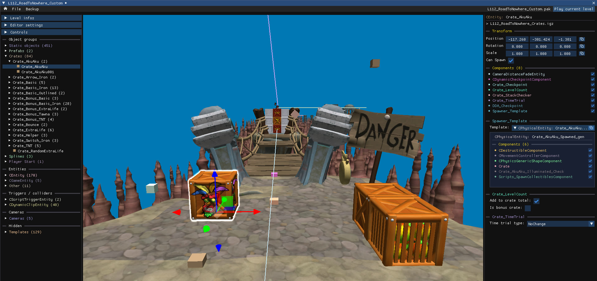
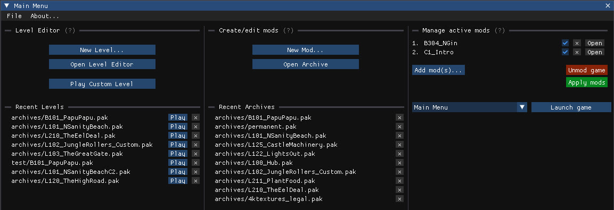
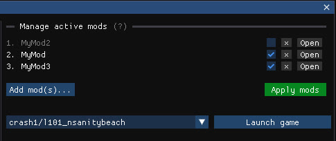

# Crash NST Level Editor

A mod manager and level editor for Crash Bandicoot: N.Sane Trilogy on PC



## Table of Contents

- [About](#about)
- [Installation](#installation)
- [Level editor](#level-editor)
- [Archive editor](#archivemod-editor)
- [Mod manager](#mod-manager)
- [Alchemy namespace](#using-the-alchemy-namespace)

## About

This project is a continuation of my earlier modding tool/proof of concept [The Apprentice](https://github.com/kishimisu/Crash-NST-Modding-Tool) which was a first attempt at understanding how the game works and how it could be modded.

This new iteration is built on an entirely new C# codebase (replacing the original javascript implementation), with a focus on performance and stability.

- Create, edit and play custom levels
- Create, edit and manage active mods
- Full access to the game assets
- Advanced tools for exporing and editing game files

## Discussion
- General discussion (The Warp Room): [https://thewarproom.com/showthread.php?tid=270](https://thewarproom.com/showthread.php?tid=270)
- Development/Help (Discord): [Skylanders Reverse Engineering](https://discord.gg/vsnVrPvVjc) (#nst-level-editor)
- Steam discussion : [https://steamcommunity.com/app/731490/discussions/0/689746131737976098/](https://steamcommunity.com/app/731490/discussions/0/689746131737976098/)

## Installation

#### Prerequisites:
- You must own an original copy of Crash Bandicoot NST PC (installed via Steam or Game Pass)
- If your game is already modded it is preferable to reinstall it before using this tool

#### Download:
You can download the prebuilt windows-x64 executable from the [Releases page](https://github.com/kishimisu/Crash-NST-Level-Editor/releases).

*Disclaimer: Some antivirus software may report false positives for the prebuilt executable. This tool operates entirely offline and does not access the network.*

#### Building locally:
Alternatively, you can build the application locally from the source code:

```
git clone https://github.com/kishimisu/Crash-NST-Level-Editor.git nst
cd nst
dotnet run
```

In order to build the application locally, [Microsoft .NET SDK 9.0](https://dotnet.microsoft.com/en-us/download/dotnet/9.0) needs to be present on your computer.

## Main Menu




## Level Editor

[Open the Level Editor documentation](README_Level_Editor.md)

Create, edit and play levels:

- **New Level**: Create a new level from scratch or based on an existing level
- **Open Level Editor**: Open an existing level using the level editor
- **Play Custom Level**: Select an existing level and launch the game with that level

## Archive/Mod Editor

[Open the Archive Editor documentation](README_Archive_Editor.md)

Create and edit archives or mods:

- **New Mod**: Creates a new empty archive
- **Open Archive**: Opens an archive/mod from the file explorer

### Mod Manager

Manage and apply mods to the game, or revert it to its original state:



- **Add mod(s)**: Adds one or more mods from the file explorer
- **Apply mods**: Applies the selected mods to the game
- **Unmod game**: Reverts the game to its original state
- **Launch game**: Launches the game at the selected level (the dropdown includes the main menu, bosses and debug levels)

## Using the Alchemy namespace

```csharp
// Open archive
IgArchive archive = IgArchive.Open(archiveDir + "L101_NSanityBeach.pak");

// Find archive file
IgArchiveFile file = archive.FindFile("L101_NSanityBeach_Crates.igz", FileSearchType.NameWithExtension)!;

// Convert to igz file
IgzFile igz = file.ToIgzFile();

// List objects of type CEntity
List<CEntity> entities = igz.FindObjects<CEntity>();

// Move all entities up
entities.ForEach(entity => entity._parentSpacePosition._z += 100.0f);

// Save igz file in archive
file.SetData(igz.Save());

// Save updated archive to disk
archive.Save();

```

## Project structure

```
src/
│
├── Alchemy/     # Alchemy-related classes
│ ├── IgArchive/ # .pak files
│ ├── IgzFile/   # .igz files
│ ├── igObject/  # Alchemy objects
│
├── Havok/       # Havok-related classes
│ ├── HavokFile/ # .hkx files
│ ├── hkObject/  # Havok objects
│
├── Editor/      # Editor application
│
├── Utils/       # Common utilities
│
├── Program.cs   # Entry point
```