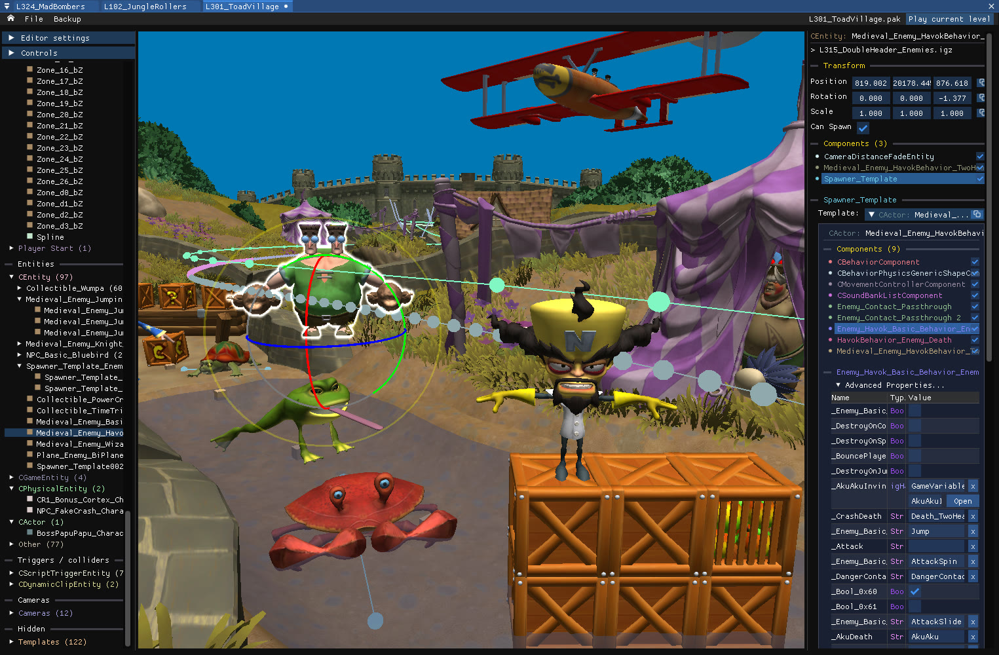

# Crash NST Maker

A mod manager and level editor for Crash NST and CTR:NF (WIP)

### Features

- Create and play custom levels
- Import objects from any level
- Manage and create mods
- Export 3D models, textures, audio
- Advanced tools for exploring and editing game files

### Get started

- [Install the editor](https://kishimisu.github.io/Crash-NST-Level-Editor/get-started/installation/)
- [Play a custom level](https://kishimisu.github.io/Crash-NST-Level-Editor/get-started/quickstart-play-level/)
- [Create your first level](https://kishimisu.github.io/Crash-NST-Level-Editor/get-started/quickstart-first-level/)

### Documentation

- [Crash NST Maker documentation](https://kishimisu.github.io/Crash-NST-Level-Editor/)