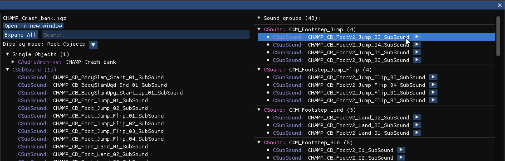

# Crash NST Level Editor

A mod manager, archive explorer and level editor for Crash Bandicoot: N.Sane Trilogy


## Table of Contents

- [Installation](#installation)
- [Main menu](#main-menu)
- [Mod manager](#mod-manager)
- [Archive manager](#archive-manager)
- [IGZ/Havok file editor](#igz-havok-file-editor)
- [Custom previews](#custom-previews)
  - [Model preview](#model-previews)
  - [Material preview](#material-previews)
  - [Texture preview](#texture-previews)
  - [Audio preview](#audio-previews)
- [Alchemy namespace](#using-the-alchemy-namespace)
- [Project structure](#project-structure)

## Installation

You can either download the prebuilt windows-x64 executable from the [Releases page](https://github.com/kishimisu/Crash-NST-Level-Editor/releases), or build the application locally from the source code:

```
git clone https://github.com/kishimisu/Crash-NST-Level-Editor.git nst
cd nst
dotnet run
```

## Main Menu

Create new mods and open archives


- **New Mod**: Creates a new empty archive
- **Open Archive**: Opens an archive/mod from the file explorer
- **Recent Files**: Lists the most recent archives opened

## Mod Manager

Manage and apply mods to the game, or revert it to its original state


- **Add mod(s)**: Adds one or more mods from the file explorer
- **Apply mods**: Applies the selected mods to the game
- **Unmod game**: Reverts the game to its original state
- **Launch game**: Launches the game at the selected level (the dropdown includes the main menu, bosses and debug levels)

## Archive Manager

View and edit files in archives (mods)


Right-click on a file to open its context menu:
- **Discard changes**: Revert any change made to the file
- **Rename**: Rename the file
- **Duplicate**: Duplicate the file
- **Extract**: Uncompress and extract the file to the disk
- **Delete**: Remove the file from the archive

Shortcuts:
- **Save (Ctrl+S)**: Save and overwrite the original archive
- **Save as (Ctrl+Shift+S)**: Save the archive to a new file

## IGZ/Havok File Editor

View and edit objects inside .igz and havok files. Objects are grouped by type and displayed in a tree on the left. Clicking on an object will display its editable properties in the right panel.


Display mode:
- **Root Objects**: Only display root/parent objects
- **Named Objects**: Only display objects that have a name
- **All Objects**: Display all objects

## Custom Previews

### Model previews

A 3D interactive preview is available for model files (located in `actors/` and `models/`).


#### Render modes:
- **No culling**: Disable culling for the model
- **Shaded**: Default render mode using Phong lighting
- **Albedo**: Render only the albedo/diffuse texture
- **UV**: Render the UVs
- **Normal**: Render normals
- **Opacity**: Render the alpha channel
- **Alpha Clip**: Render the alpha clip threshold
- **Wireframe**: Render triangles as wireframes

#### Drawcall Infos:
When first opening the file, the information about each drawcall is displayed in the right panel. It contains three fields, you can click on any of them to open the corresponding object or file:
- Drawcall object
- Material file
- Material diffuse texture

Moreover, hovering a drawcall will force to render its mesh and hide every other drawcall.

### Material previews

When opening material files (located in `materialinstances/`), each material in the file is listed in the right panel. 


It contains information about attributes that differ from the default values (culling, transparency, color...) and it also contains a clickable reference to the material's diffuse texture.

### Texture previews

When opening texture files (located in `textures/`), an image preview is displayed.


- **Extract Image**: Save the image to the disk
- **Replace Image**: Replace the image by importing a new one from the file explorer
- **R / G / B / A**: Force to render only the selected channel

### Audio previews

For audio files, an audio player is available to listen to the track(s). It's also possible to extract each track to a .mp3 file. 


There are three type of audio files:

- For `CSoundSamples` files (located in `sound_samples/`), an audio player is available in the right panel to play the sound.
- For `.snd` files (loacted in `sound_streams/`), the audio is played directly as the file is just a raw audio stream.


- For `CAudioArchive` files (locatd in `sounds/banks/`), each `CSound` object in the file is listed in the right panel, along with its associated `CSubSound` playable audio tracks. You can click on a track name to open the corresponding object and extract the audio.


## Level editor

***Coming soon!***

## Using the Alchemy namespace

```csharp
// Open archive
IgArchive archive = IgArchive.Open(archiveDir + "L101_NSanityBeach.pak");

// Find archive file
IgArchiveFile file = archive.FindFile("L101_NSanityBeach_Crates.igz", FileSearchType.NameWithExtension)!;

// Convert to igz file
IgzFile igz = file.ToIgzFile();

// List objects of type CEntity
List<CEntity> entities = igz.FindObjects<CEntity>();

// Move all entities up
entities.ForEach(entity => entity._parentSpacePosition._z += 100.0f);

// Save igz file in archive
file.SetData(igz.Save());

// Save updated archive to disk
archive.Save();

```

## Project structure

```
src/
│
├── Alchemy/     # Alchemy-related classes
│ ├── IgArchive/ # .pak files
│ ├── IgzFile/   # .igz files
│ ├── igObject/  # Alchemy objects
│
├── Havok/       # Havok-related classes
│ ├── HavokFile/ # .hkx files
│ ├── hkObject/  # Havok objects
│
├── Editor/      # Editor application
│
├── Utils/       # Common utilities
│
├── Program.cs   # Entry point
```