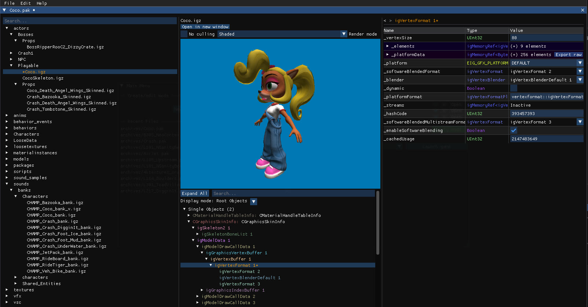
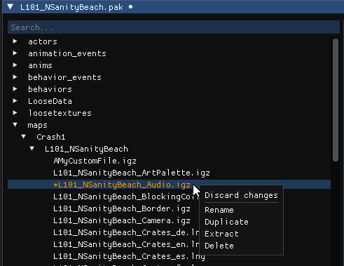
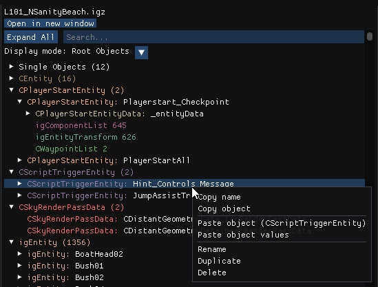
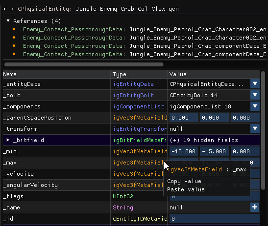
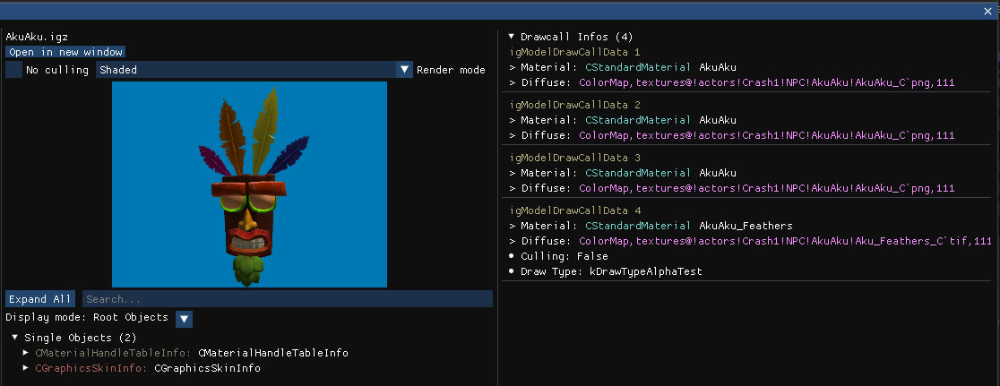
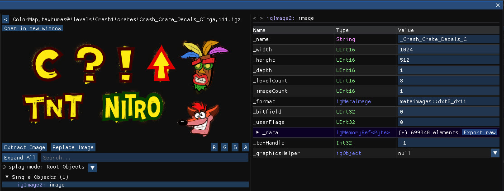
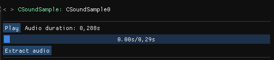

# Archive Editor

## Table of contents

- [Archive manager](#archive-manager)
- [IGZ/Havok file editor](#igz-havok-file-editor)
- [Custom previews](#custom-previews)
  - [Model preview](#model-previews)
  - [Material preview](#material-previews)
  - [Texture preview](#texture-previews)
  - [Audio preview](#audio-previews)
  
## Archive Manager

View and edit files in archives (mods)

Right-click on a file to open its context menu:
- **Discard changes**: Revert any change made to the file
- **Rename**: Change the file's name
- **Duplicate**: Create a copy of the file
- **Extract**: Uncompress and extract the file to the disk
- **Delete**: Remove the file from the archive

Shortcuts:
- **Save (Ctrl+S)**: Save and overwrite the original archive
- **Save as... (Ctrl+Shift+S)**: Save the archive to a new file

## IGZ/Havok File Editor

View and edit objects inside .igz and havok files. Objects are grouped by type and displayed in a tree on the left. Clicking on an object will display its editable properties in the right panel.

Display mode:
- **Root Objects**: Display root/parent objects
- **Named Objects**: Display objects that have a name
- **Updated Objects**: Display objects that are currently updated
- **All Objects**: Display all objects

You can right-click on any object to open a context menu:
- **Copy name**: Copy the object's name to the clipboard
- **Copy object**: Copy the object to the clipboard
- **Paste object**: Add a new object from the clipboard
- **Paste object values**: Paste the object's values from the clipboard without creating a new object
- **Rename**: Change the object's name
- **Duplicate**: Create a new copy of the object
- **Delete**: Remove the object from the file

### Object properties

- **Navigation arrows**: Go back/forward in the history of visited objects
- **Object name**: Display the object name and type
- **References**: Display a list of all objects that reference the current object. You can click on any of them to open it.
- **(Hashtable)**: Display a list of key/value pairs for objects containing hashtables
- **Properties**: Display a list of editable properties for the object. You can right-click to copy/paste complex types.

## Custom Previews

### Model previews

A 3D interactive preview is available for model files (located in `actors/` and `models/`).

#### Render modes:
- **No culling**: Disable culling for the model
- **Shaded**: Default render mode using Phong lighting
- **Albedo**: Render only the albedo/diffuse texture
- **UV**: Render the UVs
- **Normal**: Render normals
- **Opacity**: Render the alpha channel
- **Alpha Clip**: Render the alpha clip threshold
- **Wireframe**: Render triangles as wireframes

#### Drawcall Infos:
When first opening the file, the information about each drawcall is displayed in the right panel. It contains three fields, you can click on any of them to open the corresponding object or file:
- Drawcall object
- Material file
- Material diffuse texture

Moreover, hovering a drawcall will force to render its mesh and hide every other drawcall.

### Material previews

When opening material files (located in `materialinstances/`), each material in the file is listed in the right panel. 

It contains information about attributes that differ from the default values (culling, transparency, color...) and it also contains a clickable reference to the material's diffuse texture.

### Texture previews

When opening texture files (located in `textures/`), an image preview is displayed.

- **Extract Image**: Save the image to the disk
- **Replace Image**: Replace the image by importing a new one from the file explorer
- **R / G / B / A**: Force to render only the selected channel

### Audio previews

For audio files, an audio player is available to listen to the track(s). It's also possible to extract each track to a .mp3 file. 

There are three type of audio files:

- For `CSoundSample` igz files (located in `sound_samples/`), an audio player is available in the right panel to play the sound.

- For `.snd` files (located in `sound_streams/`), the audio is played directly as the file is just a raw audio stream.

- For `CAudioArchive` igz files (located in `sounds/banks/`), each `CSound` object in the file is listed in the right panel, along with its associated `CSubSound` playable audio tracks. You can click on a track name to open the corresponding object and extract the audio.
