# Table of Contents

- [New Level](#new-level)
- [Level Editor](#level-editor)
- [Controls/shortcuts](#controls)
- [Create new objects](#create-new-objects)
- [Object properties](#object-properties)
---
- [Special objects](#special-objects)
  - [Static Models](#static-models)
  - [Spawner Templates](#spawner-templates)
  - [Prefab Instances](#prefab-instances)
  - [Script Triggers](#script-triggers)
  - [Dynamic Clips](#dynamic-clips)
---
- [Special components](#special-components)
  - [Splines](#splines)
  - [Trigger Volumes](#trigger-volumes)
  - [Outline Switch Crate](#outline-switch-crate)
  - [Checkpoint Text](#checkpoint-text)
  - [On Start Music](#on-start-music)

# New Level

You can either create a new level from scratch or duplicate an existing level:

- Choose any existing level as the base for your new level,

- Or choose "`none`" to create a new empty level containing:
  - a camera
  - a light source
  - a music theme
  - a level start & level end
  - a platform with collisions
  - most common crates

Choosing "`none`" also unlocks these additional parameters:
  - **Lighting**: Import the main lighting/ambience from another level
  - **Music**: Import the main music theme from another level (you can still import custom music later on)
  - **Mode**: Crash 1, 2 or 3 (used to create the level start & end)

_basic empty template_:

# Level Editor

## Key features

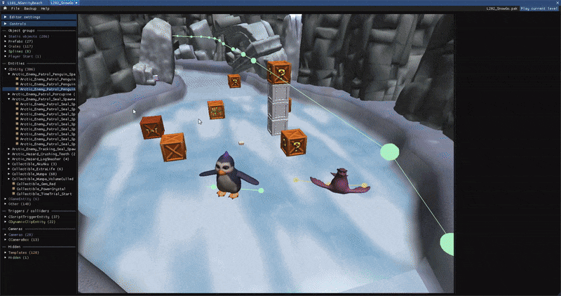

- Open multiple levels at once (click on the `Home` icon in the top left or `File -> Open` after opening a first level)
- Select multiple objects using Shift
- Copy and paste selected objects (Ctrl+C / Ctrl+V) from one level editor to another
- Use the quick-access menu (right-click) to easily import useful objects
- Create tabs by clicking on the title of a window and dragging it over another window's title to make it easier to switch between levels

You can also find the list of all objects that have already been tested here: [docs.google.com/spreadsheets/d/1jVLJTm1idsps4p5KSXfI80fT5y7HFQuSiLOLkI18K30](https://docs.google.com/spreadsheets/d/1jVLJTm1idsps4p5KSXfI80fT5y7HFQuSiLOLkI18K30/edit?usp=sharing)

## Save & Play

You can play the current level by clicking this button at the top-right of the level editor:

It won't include unsaved changes.
- Use `Ctrl+S` to save the level
- Use `Ctrl+L` to backup, save and launch the level
- When sharing levels, consider using `File -> Compress & Save` to reduce the level size

#### Backup menu
- You can manually backup and restore the level. It will be saved under `<level_name>.pak.backup`
- An automatic backup is created each time you use `Ctrl+L`, overwriting the previous automatic backup for this level

## Level Infos

Settings & properties for the current level.
These options are only available for custom levels.

Level Name
- **Name**: Level's name (appears on level load)
- **Hint**: Level's hint (appears on level load)

Level settings:
- **Character**: Which character to use when starting the level (Crash/Coco)
- **Crash Mode**: The current Crash version (affects the pause menu style and the level start/end)
- **Gameplay Mode**: The starting gameplay mode/vehicle (Traditional, Swimming, Motorbike, Jetski, Plane)
- **Enable Ride**: Whether to enable special objects for this level (they won't work otherwise)

## Editor Settings

Debug settings for the level editor

- **Free Memory On Close**: The app will automatically clear its memory once all level editors have been closed, but you can enable this option to force clearing the memory each time you close a level editor (if you encounter memory issues). It's disabled by default because it can sometimes crash the editor.

- **Render distance**: How far to render into the scene. Decrease this value to increase performances

- **Debug Mode**:
  - **Static Collisions**: Highlight objects that have collisions
  - **Prefabs**: Highlight prefab instances and entities that are part of a prefab
  - **Game Objects**: Highlight all game objects (enemies, hazards, obstacles...)

- **Visible Camera Layers**:
Choose which object layers should be visible by default to increase performances and to clean up the scene. Most of these layers will still be visible with an active selection.

## Object Tree

Contains the list of all objects in the level, grouped by type. Click on an element to open its properties, double click to focus it in the scene.

3D Game Objects:

- **Static Objects**: Contains static models, which represent most of the level's geometry and can have baked-in collisions (See [#static models](#static-models))
- **Prefabs**: Contains all instanciated prefab entities (See [#prefabs](#prefab-instances))
- **CEntity / CGameEntity / CPhysicalEntity**: Contains most of the level's game objects (enemies, hazards, obstacles... see [#spawner templates](#spawner-templates))
- **CActor**: Contains character entities (bosses and advanced enemies...)
- **Crates**: Contains all crates in the level
- **Collectibles**: Contains all collectibles in the level

Other Game Objects:

- **Player Start**: Contains the player start entity (where the character is spawned when starting the level)
- **Triggers**: Contains `CScriptTriggerEntity` objects (see [#script triggers](#script-triggers))
- **Clips**: Contains `CDynamicClipEntity` objects (see [#dynamic clips](#dynamic-clips))
- **Cameras**: Contains all types of cameras
- **CameraBox**: Contains camera transitions

Other:

- **Lighting**: Contains light sources and visual boxes
- **VFX**: Contains visual effects
- **SFX**: Contains sound effects and music
- **Other**: Contains all other entities without a model, such as the WorldInstance

Hidden:
- **Templates**: Spawner templates (see [#spawner templates](#spawner-templates))
- **Hidden**: Hidden objects

# Scene View

This is where you can move around in the level, select one or multiple objects, edit their position/rotation/scale or copy/paste/delete them.

### Controls

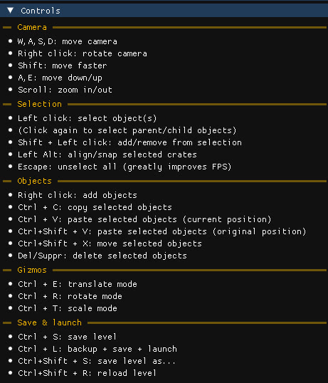

### Create new objects

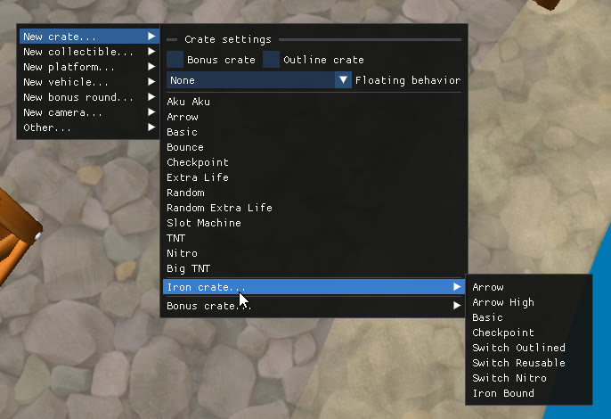

Use the quick-access menu (right-click) to create various objects:
- **New Crate**: Create all types of crates
- **New Collectible**: Create all types of collectibles
- **New Platform**: Create new platforms and teleporters
- **New Vehicle**: Create new vehicles (Jet Board, Baby TRex, Hog, Bear, Tiger, Jetpack)
- **New Bonus Round**: Import a bonus round from C1 (tawna/brio/cortex) or any bonus round from C2/C3
- **New Camera**: Create a new camera (Relative Camera, Spline Camera or Free Camera) or a new camera transition zone
- **Other**: Create other useful objects (Death Trigger, Invisible Walls...)

## Object properties

Contains every editable property for the currently selected object.

The first line contains the object's type and name, the second line contains the parent file name (click to open)

If the object has any parent or children, they will also be displayed (click to focus)

### Transform

Edit the position, rotation and scale of the object.
Note that you can also do this using the 3D gizmos (Ctrl+E to translate, Ctrl+R to rotate, Ctrl+T to scale)

- `Click & drag` to edit values like a slider (use shift, ctrl or alt to change the speed)
- `Double click` to manually input values
- Click the icon on the right to copy/paste values

When applicable, the object's model can also be changed via a dropdown containing the list of all currently loaded models across level editors.

### Components

This is where the object's behavior, model, animations, sounds, properties and so on... are defined.
You can copy, paste, delete or replace components between different objects.

The list of all components is located at the top, and the currently selected component at the bottom.

- Click on the checkbox on the right to enable/disable a component
- `Click` on a component to select it
- `Click+Drag` or `Shift+Click` for range selection
- `Right click` on a component to open the context menu (copy/paste/delete components)

You can also copy/paste values from a component to another instead of pasting it as a new component:

# Special objects

## Static models

These objects represent most of the level's geometry and can have baked-in collisions.

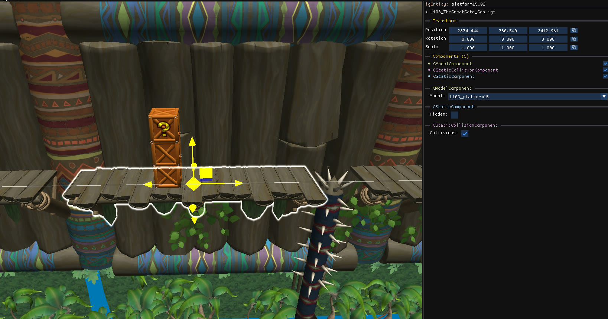 

Static models always have 3 components:

- `CModelComponent`: can be used to change the object's model
- `CStaticComponent`: can be used to change the object's visibility
- `CStaticCollisionComponent`: can be used to enable or disable collisions for the object. If the option is greyed out, it means that this object doesn't come with baked-in collisions.

## Spawner Templates

These objects are responsible for spawning most entities in the game (crates, enemies, platforms...)

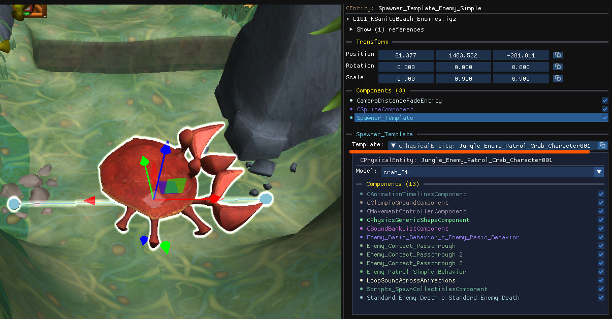 

You can spot them by their `Spawner_Template` component, which is selected and expanded by default.

Objects with this component are called "Spawners", and they reference a "Template" object, which is the object that is actually spawned and that contains all the advanced properties.

The spawner itself usually contains very few components (such as splines or trigger volumes) and is mainly used to set the position and rotation for spawning the underlying template.

Template objects are hidden by default because their position is meaningless (it's the parent spawner that defines the spawn point). However for some very specific enemies, the position of the template is actually meaningful, this is why you can enable them using `Editor settings -> Visible Camera Layers -> Templates`

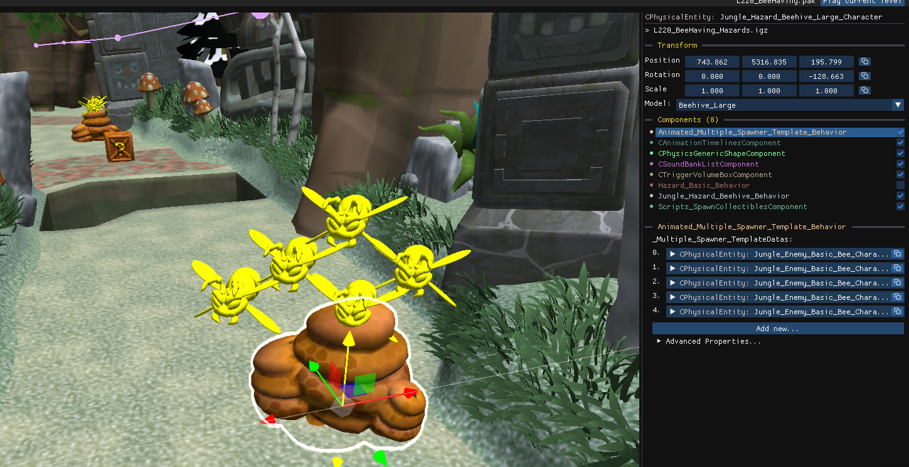 

Templates with multiple references:

If a template has multiple parents, updating it from its parent spawner (using the `Spawner_Template` component) instead of directly from the template will result in a copy of the template being made first, such that no other spawner is affected by that change.

## Prefab Instances

Prefabs are a special type of objects as they reference a group of child objects that is reused across all instances of the same prefab.

You can edit prefab instances independently, but editing any of these child object will reflect across all prefab instances at the same time:

- **Edit prefab instance**: Click on any child object to select the parent prefab instance (1st picture). At this point you can treat this group as a regular object, copy/paste and move it
without affecting any other instance.

- **Edit prefab child**: However if you click a second time on a child object (2nd picture), you'll see that every occurence of this object in other instances becomes highlighted. You now have control over the child object inside the prefab, you can still copy/paste, move and delete it but this will reflect across all other prefab instances.

## Script Triggers

`CScriptTriggerEntity` objects are invisible boxes that trigger an action for one or multiple other objects when the player enters its bounds. 

They're pretty flexible, they can either be a parent or a child of the object to trigger, and can reference/be referenced by multiple objects.

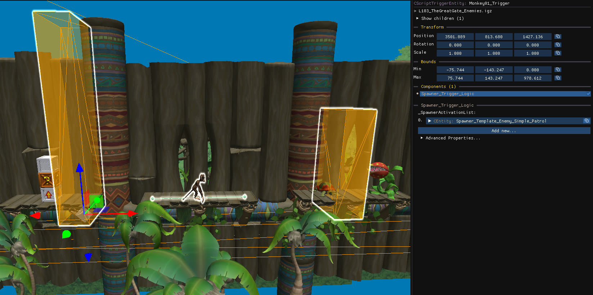 

Among other things, they are used with [Spawner Templates](#spawner-templates) to trigger the actual spawn or make the object active. This is done for performance reasons, so that not all objects are loaded at once, but they can also be used to trigger other effects or behaviors.

Most of the time if you have an issue where an object doesn't spawn in-game but appears fine in the editor, it's because of a misplaced trigger volume.

They're hidden by default to improve visibility, but you can enable them using `Editor settings -> Visible Camera Layers -> Triggers`.

Trigger and child selection:
- `Click` on a trigger to select all of its children
- `Click twice` on a trigger to select it individually
- `Click twice` on an entity to select all of its parent triggers

Trigger and child copy/paste:
- `Copy/paste` child entities (without selecting any trigger) will add the new objects to the previous triggers
- `Copy/paste` child entities + their parent triggers will add the new objects to the new triggers

## Dynamic Clips

`CDynamicClipEntity` objects are invisible boxes that collide with the player (and/or enemies), acting as invisible walls/floors.

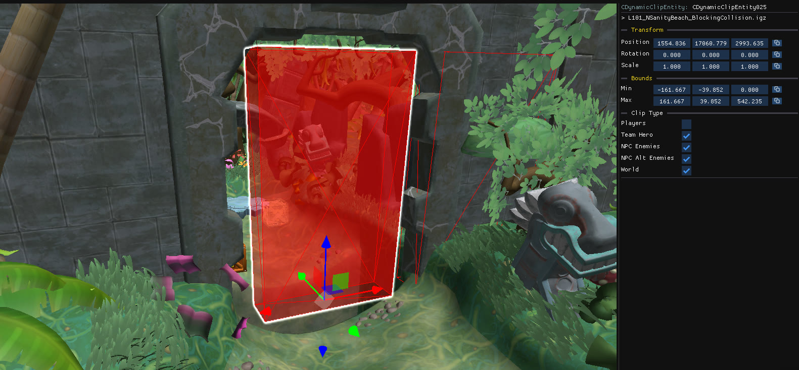 

# Special components

## Splines

`CSplineComponent` are a special type of component that represent a path made of positions and rotations.
They are primarily used for camera paths and enemy/platforms movement.

 

The GUI for the spline component consists of up to 4 sections:

- **Positions**: the X,Y,Z position of each control point relative to the spline entity
- **Rotations**: the first value represents a distance along the spline, and the last three values contains the euler rotation in degrees at that distance.
- **Velocity**: stores a list of velocities defining the speed at which objects move along the spline
- **Markers**: only contains a distance along the spline, used by some entities to define "start" and "end" points to move along to.

The controls points (positions) are always visible in the 3D scene, however the rotations and markers are only visible when the list is expanded.

**Spline GUI controls**:
- Edit values with click+drag
- `Click` on an item to select it
- `Shift+click` to select a range
- `Ctrl+click` to add/remove from selection
- `Suppr/del` to remove from selection
- `Right click` to add new items
- `Double click` to focus in the 3D scene

**3D controls**:
- `Click` on a spline to select it and all of its control points
- `Click again` on a control point to select it individually
- `Shift+click` to add/remove a control point from the selection

## Trigger Volumes

`CTriggerVolumeBox` components are similar to [Script Triggers](#script-triggers) objects as they define a 3D bounding box that triggers an event.

However, unlike script triggers which are separate objects, trigger volume components are part of the object to trigger. They are only visible when the component is selected.

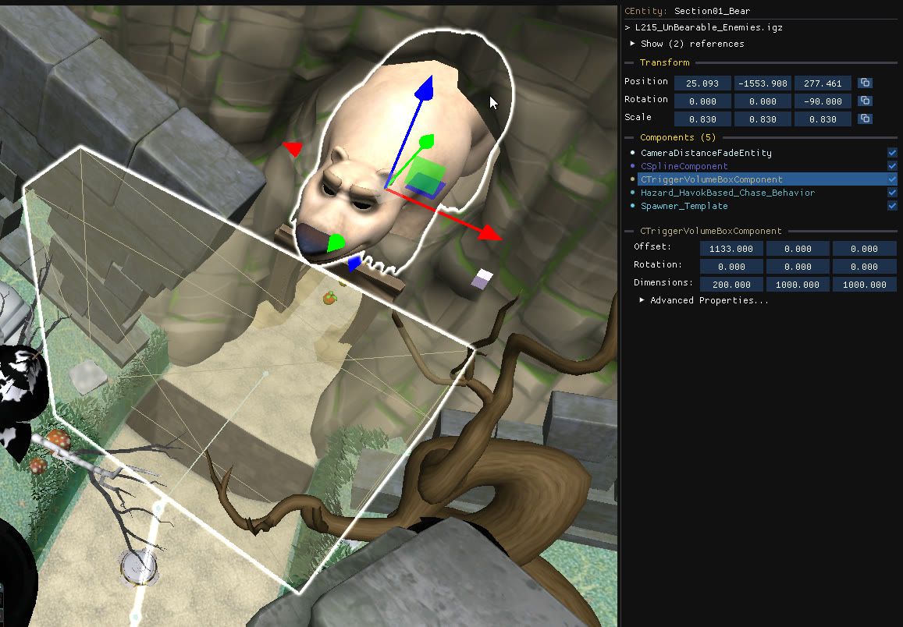

## Outline Switch Crate

Outline switch crates have a custom GUI where you can add, remove or change children outlined crates.

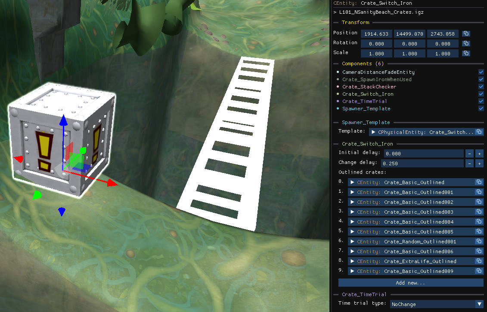

## Checkpoint Text

It's possible to change the text that is displayed when breaking checkpoints, along with some other properties

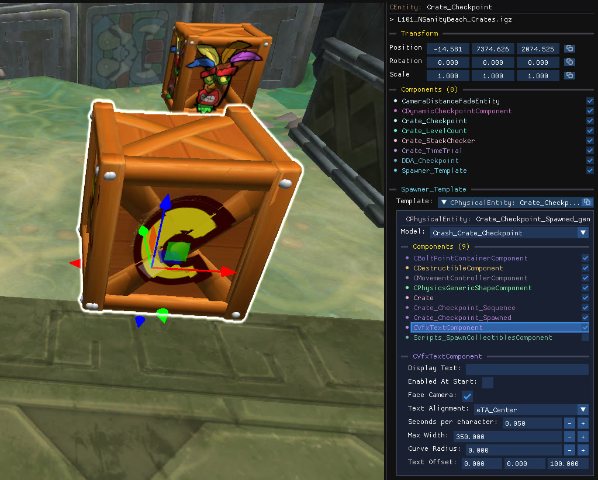

## On Start Music

You can listen to the default music, and import your own audio files (.mp3) using this component.

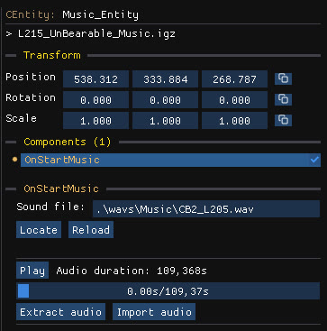