# Table of Contents

- [New Level](#new-level)
- [Level Editor](#level-editor-1)
  - [Level infos](#level-infos)
  - [Editor settings](#editor-settings)
  - [Object Tree](#object-tree)
- [Scene View](#scene-view)
  - [Add Objects](#create-new-objects)
  - [Prefabs](#prefabs)
- [Object Properties](#object-properties)
  - [Transform](#transform)
  - [Components](#components)
  - [Splines](#splines)

# New Level

You can either create a new level from scratch or duplicate an existing level.

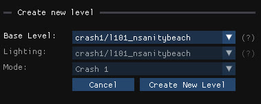

- Choose any existing level as the base for your new level,

- Or choose "`none`" to create a new empty level containing:
  - a camera
  - a light source
  - a level start & level end
  - a platform with collisions
  - most common crates

Choosing "`none`" also unlock these additional parameters:
  - **Lighting**: Import the main lighting/ambience from another level
  - **Mode**: Crash 1, 2 or 3 (used to create the level start & end)

_basic empty template_:

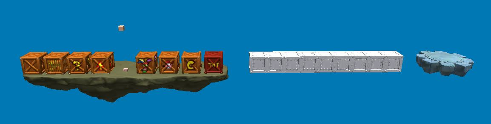

# Level Editor

## Play

You can play the current level by clicking this button at the top-right of the level editor:

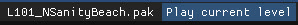

This won't include unsaved changes. If you want to test your latest changes you'll need to save the archive first (`Ctrl+S`), or use the "Save and Launch" shortcut (`Ctrl+L`)

## Level Infos

Settings & properties for the current level.
This option is only available for custom levels.

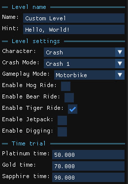

- **Name**: Level's name (appears on level load)
- **Hint**: Level's hint (appears on level load)
- **Character**: Which character to use when starting the level (Crash/Coco)
- **Crash Mode**: The current Crash version (affects the pause menu style and the level start/end)
- **Time Trial**: Times for the platinum, gold and sapphire relics

## Editor Settings

Debug settings for the level editor

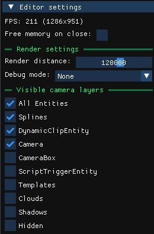

- **Render distance**: How far to render into the scene. Decrease this value to increase performances

- **Debug Mode**:
  - **Static Collisions**: Highlight objects that have collisions
  - **Prefabs**: Highlight prefab instances and entities that are part of a prefab
  - **Game Objects**: Highlight all game objects (enemies, hazards, obstacles...)

- **Visible Camera Layers**:
Choose which object layers should be visible by default to increase performances and to clean up the scene. Most of these layers will still be visible with an active selection.

## Object Tree

Contains the list of all objects in the level, grouped by type. Click on an element to open its properties, double click to focus it in the scene.

3D Entities:

- **Static Objects**: Contains static entities, which represent most of the level's geometry and can have baked-in collisions
- **Prefabs**: Contains all instanciated prefab entities (See #prefabs)
- **Crates**: Contains all crates in the level
- **Splines**: Contains all spline entities (paths)
- **Player Start**: Contains the player start entity (where the character is spawned when starting the level)
- **CEntity / CGameEntity / CPhysicalEntity**: Contains most of the level's game objects (enemies, hazards, obstacles...)
- **CActor**: Contains character entities (Fake crash, bosses...)

Objects without a model:
(these appear as colored cubes in the level editor)

- **CScriptTriggerEntity**: Contains trigger entities (activates something when the player enters its bounds)
- **CDynamicClipEntity**: Contains clipping entities (invisible boxes that collide with the player)
- **Other**: Contains all other entities without a model such as VFX or SFX effects
- **Cameras**: Contains all types of cameras
- **CameraBox**: Areas where a camera is active/transitions between cameras
- **Templates**: Spawner templates
- **Hidden**: Hidden objects

## Scene View

This is where you can move around in the level, select objects, change their position, rotation and scale and copy/paste/delete them.

**Controls**:
- `W,A,S,D`: move the camera (hold `Shift` to move faster)
- `Right-click`: rotate the camera
- `Left-click`: select object
- `Shift + Left Click`: add object to selection
- `Ctrl + C`: copy selected objects
- `Ctrl + V`: paste selected objects
- `Del/Suppr`: delete selected objects

**Note that you can open multiple level editors at the same time, and copy/paste objects from one level to another.**

You can also change the transform mode for the selection:
- `Ctrl + E`: translate
- `Ctrl + R`: rotate
- `Ctrl + T`: scale

### Create new objects

Use the right-click context menu to create new crates, collectibles or cameras:

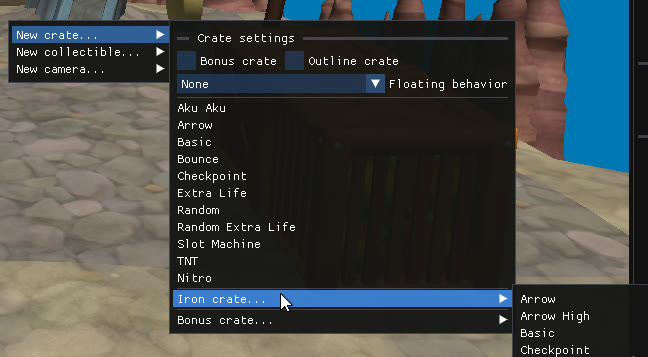
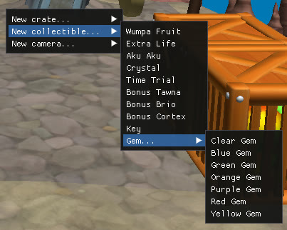

### Prefabs

Prefabs are a special type of objects as they reference a group of child objects that is reused across all instances of the same prefab.

You can edit prefab instances independently, but editing any of these child object will reflect across all prefab instances at the same time:

- **Edit prefab instance**: Click on any child object to select the parent prefab instance (1st picture). At this point you can treat this group as a regular object, copy/paste and move it
without affecting any other instance.

- **Edit prefab child**: However if you click a second time on a child object (2nd picture), you'll see that every occurence of this object in other instances becomes highlighted. You now have control over the child object inside the prefab, you can still copy/paste, move and delete it but this will reflect across all other prefab instances.

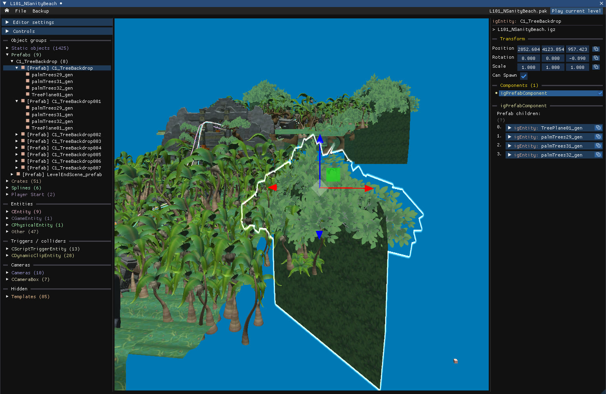
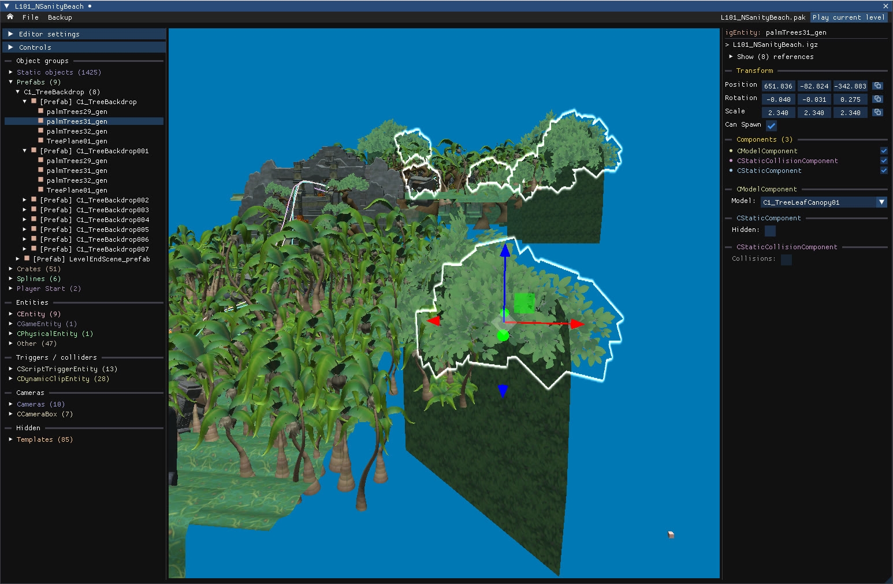

## Object properties

Contains the transform, the list of components and their properties for the selected object.

The first line contains the object's type and name, the second line contains its parent file (click to open)

### Transform

Edit the position, rotation and scale of the object.
Note that you can also do this using the 3D gizmos (Ctrl+E to translate, Ctrl+R to rotate, Ctrl+T to scale)

- `Click & drag` to edit values like a slider
- `Double click` to manually input values
- Click the icon on the right to copy/paste values

### Components

This is where the object's behavior, model, animations, sounds, properties and so on... are defined.
You can copy, paste, delete or replace components between difference objects.

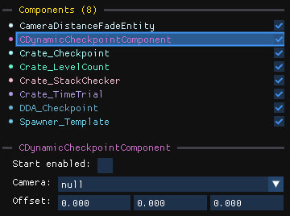

You can find the list of components at the top, and the currently selected component at the bottom.

- Click on the checkbox on the right to enable/disable a component
- `Click` on a component to select it
- `Click+Drag` or `Shift+Click` for range selection
- `Right click` to open the context menu
- `Ctrl+C/V` to copy/paste selected components
- `Suppr/Del` to delete selected components

You can also copy/paste values from a component to another instead of pasting it as a new component:

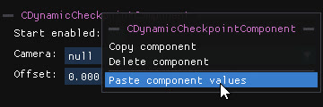

## Special components

### Splines

Splines are a special type of component that represent a path made of positions and rotations.
They are primarily used for camera paths and enemy/platforms movement.

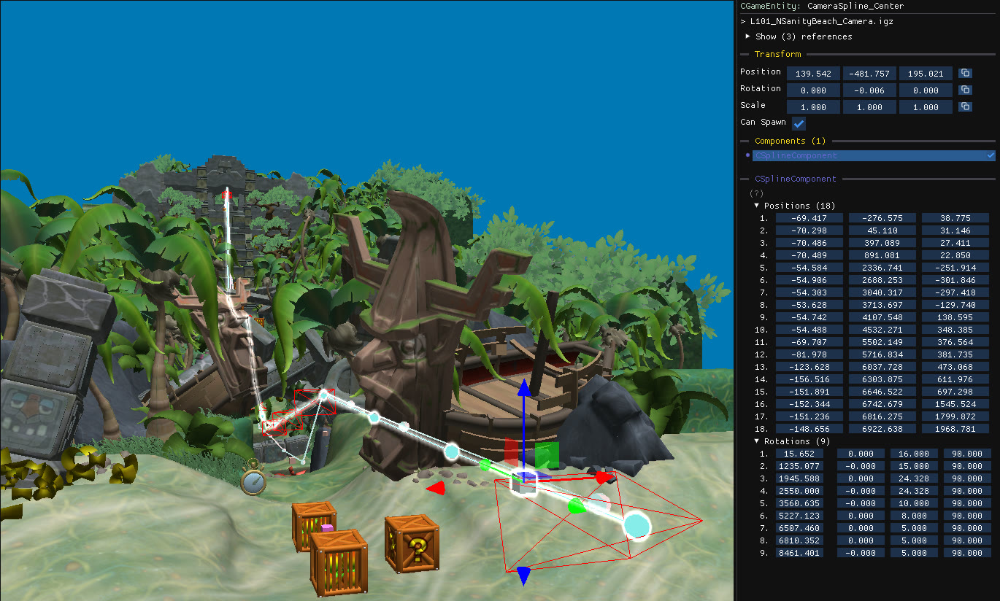

The GUI for the spline component consists of up to 3 sections:

- **Positions**: the X,Y,Z position of each control point relative to the spline entity
- **Rotations**: the first value represents a distance along the spline, and the last three values contains the euler rotation in degrees at that distance.
- **Markers**: they only contain a distance along the spline, used by some entities to define "start" and "end" points to move along to.

The controls points (positions) are always visible in the 3D scene, however the rotations and markers are only visible when the list is expanded.

**GUI controls**:
- Edit values with click+drag
- `Click` on an item to select it
- `Shift+click` to select a range
- `Ctrl+click` to add/remove from selection
- `Suppr/del` to remove from selection
- `Right click` to add new items
- `Double click` to focus in the 3D scene

**3D controls**:
- `Click` on a spline to select it and all of its control points
- `Click again` on a control point to select it individually
- `Shift+click` to add/remove a control point from the selection