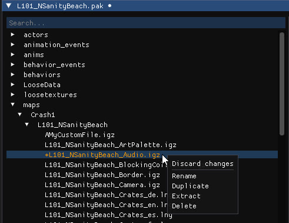

The left panel of the archive editor lists the files of the archive in their folders, with a search bar at the top. Files you modified are marked with an asterisk.

## File actions

Right-click a file to open its context menu:

| Entry | Effect |
| --- | --- |
| **Discard changes** | Reverts every change made to the file. |
| **Rename** | Changes the file's name. |
| **Duplicate** | Creates a copy of the file. |
| **Extract** | Uncompresses the file and saves it to disk. |
| **Delete** | Removes the file from the archive. <kbd>Del</kbd> does the same for the selected file. |

Right-click a **folder** to create new files and folders inside it, and right-click an **empty archive** to create its first file. Right-click a file to **add it to or exclude it from the package file**, the index that tells the game which files the archive provides. The package file is rebuilt automatically when you save, and external dependencies are included in it when you copy objects across archives.

## Save

| Action | Shortcut |
| --- | --- |
| Save and overwrite the archive | <kbd>Ctrl</kbd>+<kbd>S</kbd> |
| Save to a new file | <kbd>Ctrl</kbd>+<kbd>Shift</kbd>+<kbd>S</kbd> |
| Open another archive | <kbd>Ctrl</kbd>+<kbd>O</kbd> |

Options let you **compress or uncompress** the archive on save; ZLIB compression is supported. The **backup and restore** options keep a copy of the archive before you experiment. Archives larger than 2 GB are supported since v1.38.

## File menu

- **Remove unused files** drops the files nothing references, to reduce the archive size.
- `Archive → Extract all files` extracts every file at once.
- `Archive → Update level name` sets a level archive up for use in a [custom hub](/level-editor/custom-hubs-and-modpacks/).
- `Archive → Export level to .gltf` exports the level's models. See [Export to glTF](/level-editor/export-to-gltf/).

## What is in an archive

| Folder | Contents |
| --- | --- |
| `actors/`, `models/` | 3D models, with a [model preview](/archive-editor/previews/#model-previews) |
| `materialinstances/` | Materials, with a [material preview](/archive-editor/previews/#material-previews) |
| `textures/` | Textures, with a [texture preview](/archive-editor/previews/#texture-previews) |
| `sound_samples/`, `sound_streams/`, `sounds/banks/` | Audio, with an [audio player](/archive-editor/previews/#audio-previews) |
| `maps/` | The level files: entities, crates, cameras, collisions, lighting and more, edited in the [IGZ editor](/archive-editor/igz-and-havok-editor/) |
| `anims/`, `behaviors/`, `animation_events/`, `behavior_events/` | Animations and behaviours |
