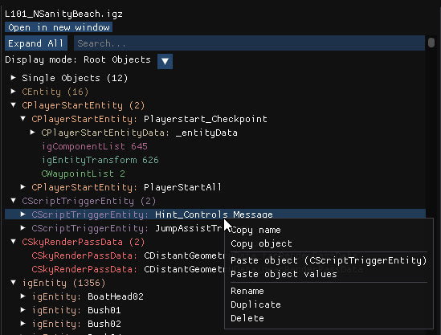
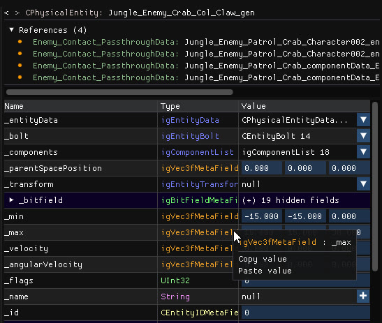

Open an `.igz` or a Havok file from the archive tree to edit the objects it contains. Objects are grouped by type in a tree on the left; click one to display its editable properties on the right. **Open in new window** detaches the editor, and **Expand All** and the search bar help you find an object.

## Display modes

| Mode | Shows |
| --- | --- |
| **Root Objects** | The root and parent objects |
| **Named Objects** | The objects that have a name |
| **Updated Objects** | The objects you modified |
| **All Objects** | Everything |

## Object actions

Right-click any object:

| Entry | Effect |
| --- | --- |
| **Copy name** | Copies the object's name to the clipboard. |
| **Copy object** | Copies the object. |
| **Paste object** | Adds a new object from the clipboard. Objects can be pasted into another file or another archive; their dependencies are imported automatically. Shallow, deep and full clone options are available. |
| **Paste object values** | Pastes the values into the selected object without creating a new one. |
| **Rename**, **Duplicate**, **Delete** | Rename, copy or remove the object. Deleting an object that others reference cleans up those references. <kbd>Del</kbd> deletes the selected object. |

## Object properties

- **Navigation arrows** go back and forward through the objects you visited.
- The **object name and type** are displayed at the top.
- **References** lists every object that references the current one. Click one to open it.
- **Hashtable**, for objects that contain one, lists its key and value pairs.
- **Properties** is a table of every field with its name, type and value. Vectors, references, strings, enums and bit fields all have a matching editor.

### Editing fields

- Right-click a value to **copy** or **paste** it, which also works for complex types.
- Object references (`igObjectRef`) are dropdowns; you can create a new instance of the right type from the dropdown.
- Strings can be set to `null`, and a `+` button creates a value where there is none.
- Memory fields let you add and remove elements.
- The field context menu can **convert handles to and from EXID** and **clear memories**.
- Editing works the same way in Havok files.

:::tip
Every change marks the parent file as updated, so the **Updated Objects** display mode and the asterisks in the archive tree always tell you what you touched.
:::
