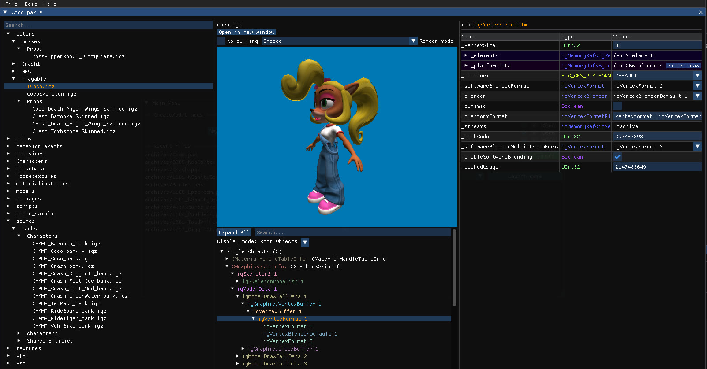

The Archive Editor opens any `.pak` archive such as original game files, mods and custom levels, and lets you view and edit the files inside. It's the place to go when you need to see or change something the level editor does not expose.

## What you can do

- Browse, rename, duplicate, extract and delete the files of an archive, or add new ones. See [Archive manager](/archive-editor/archive-manager/).
- Open the `.igz` and Havok `.hkx` files and edit every object and every field they contain. See [IGZ and Havok editor](/archive-editor/igz-and-havok-editor/).
- Preview models in 3D, materials, textures and audio, extract or replace them, and export models to glTF. See [Previews](/archive-editor/previews/).
- Create a mod from an empty archive with **New Mod...** in the main menu.
- Script all of this in C# with the Alchemy namespace. See [Alchemy API](/archive-editor/alchemy-api/).

## How to open it

- **Open Archive** in the [main menu](/get-started/first-launch/), or **New Mod...** for an empty archive.
- From the level editor, click the file name under an object's name in the [properties panel](/level-editor/object-properties/), or the **Open model file** button. Objects the level editor cannot display are focused in the archive editor when you click them.

## Safety

The editor never overwrites an original game file without asking for confirmation. Use **Save as...** to keep the original untouched, or create a **Backup** to prevent this message from appearing. Archives are not fully loaded into memory when opened; file data is read only when needed, which keeps large archives usable.

## Supported games

Archives from Crash Bandicoot N. Sane Trilogy (PC) and from Crash Team Racing Nitro-Fueled (PS4) are supported.
