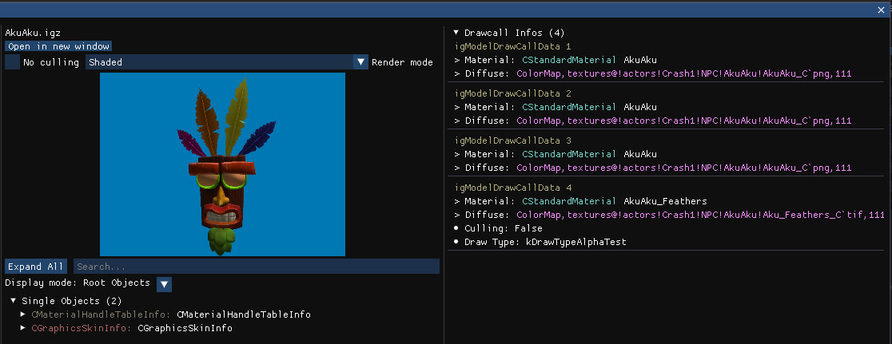
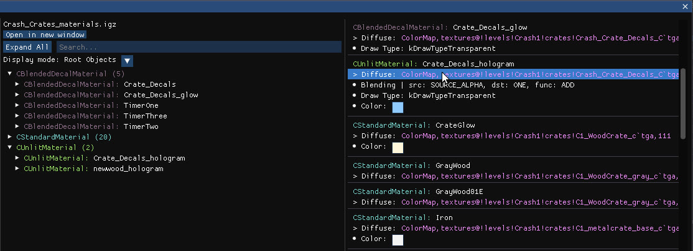
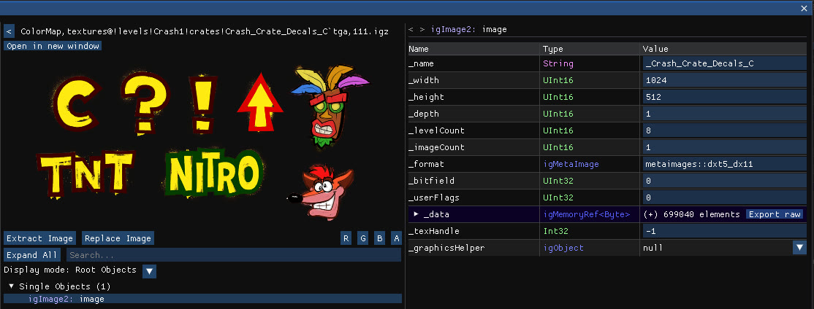
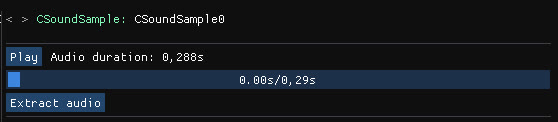
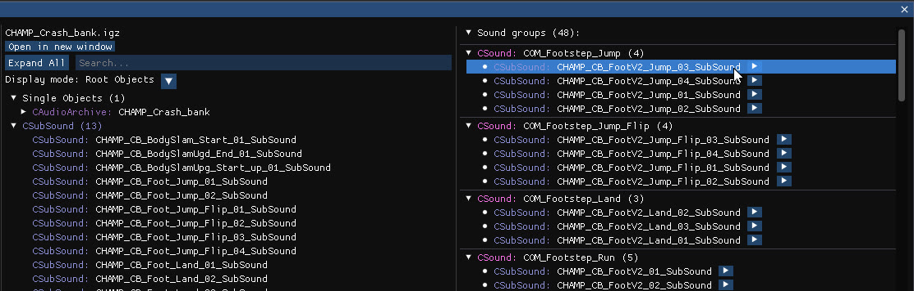

Some file types open in a dedicated preview instead of the raw object tree.

## Model previews

Model files, found in `actors/` and `models/`, open in an interactive 3D preview.

### Render modes

| Mode | Shows |
| --- | --- |
| **No culling** | Disables culling for the model |
| **Shaded** | The default, with Phong lighting |
| **Albedo** | Only the albedo or diffuse texture |
| **UV** | The UV coordinates |
| **Normal** | The normals |
| **Opacity** | The alpha channel |
| **Alpha Clip** | The alpha clip threshold |
| **Wireframe** | Triangles as wireframes |

### Drawcall infos

When the file opens, the right panel lists every drawcall of the model. Each one shows three clickable entries that open the corresponding object or file: the drawcall object, the material file, and the material's diffuse texture. Hovering a drawcall renders only its mesh and hides every other one, which is handy to find which part of a model uses which material.

**Export to .gltf** exports the model with its PBR textures. See [Export to glTF](/level-editor/export-to-gltf/).

## Material previews

Material files, found in `materialinstances/`, list every material of the file in the right panel.

Each material shows the attributes that differ from their default values, such as culling, transparency and colour, and a clickable reference to its diffuse texture.

## Texture previews

Texture files, found in `textures/`, show an image preview.

- **Extract Image** saves the image to disk.
- **Replace Image** imports a new image from the file explorer in place of the current one.
- **R**, **G**, **B**, **A** render only the selected channel.
- Textures that contain several images, or LOD levels, can be browsed image by image since v1.35.

Swizzled textures from CTR:NF are displayed correctly.

## Audio previews

Audio files open an audio player. Every track can be extracted to an `.mp3` file, and custom audio can be imported into `.snd` files, `CSoundSample` and `CSubSound` objects.

| File type | Location | Behaviour |
| --- | --- | --- |
| `CSoundSample` IGZ files | `sound_samples/` | An audio player in the right panel plays the sound. |
| `.snd` files | `sound_streams/` | Played directly, as the file is a raw audio stream. |
| `CAudioArchive` IGZ files | `sounds/banks/` | Each `CSound` object is listed with its playable `CSubSound` tracks. Click a track name to open the object and extract the audio. |

Playback starts at 25 percent volume and files do not auto-play when opened; auto-play can be turned back on in the settings.
