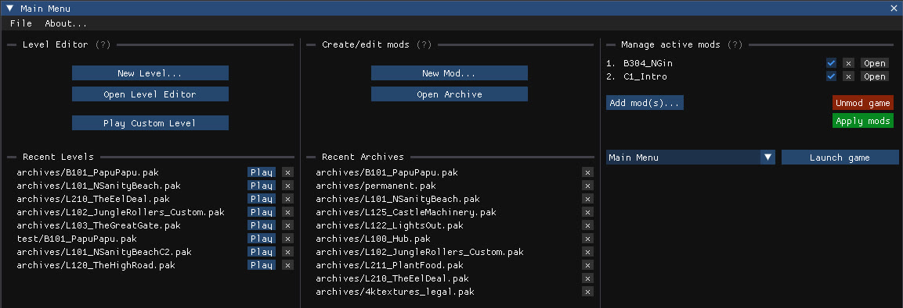

When you start Crash NST Maker you land on the main menu. It is split into three panels:

## Level Editor (left panel)

Create and play custom levels.

- **New Level...** creates a level from scratch or duplicates an existing one. See [Create a new level](/level-editor/create-a-new-level/).
- **Open Level Editor** opens an existing level (original or custom) in the [Level Editor](/level-editor/overview/).
- **Play Custom Level** launches the game directly into a custom level or hub. See [Play a custom level](/get-started/quickstart-play-level/).
- **Recent Levels** lists the levels you opened last. Click on a level to open it with the Level Editor, or click **Play** to launch it with the game.

## Archive Editor (middle panel)

Create mods, browse game files, extract assets...

- **New Mod...** creates a new, empty archive.
- **Open Archive Editor** opens any archive in the [Archive Editor](/archive-editor/overview/).
- **Recent Archives** lists the archives you opened last. Click on an archive to open it with the Archive Editor.

:::note
A level is also an archive! You can open a level either in the Level Editor or the Archive Editor, so a level archive can appear in both panels.
:::

## Manage active mods (right panel)

This is the Mod Manager: add mods, apply them to the game, revert them, and launch the game at any level, including the main menu, bosses and debug levels.

## The File menu

The `File` menu at the top of the main menu holds application-wide options:

- **Set game path**: change the path to the game's executable (`CrashBandicootNSaneTrilogy.exe`)
- **Set steam path**: change the path to steam's executable (`steam.exe`, only required for the `skip steam popup` option).
- **Skip steam popup**: skip the Steam confirmation popup that appears every time you launch a custom level.

## Windows, tabs and docking

Each editor opens in its own window within the application. You can dock and group windows by dragging one window's title bar onto another; the windows then appear as tabs, making it easy to switch between several open levels. Click the Home icon in the top-left corner to return to the main menu at any time.