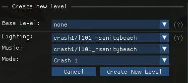

import { Steps, CardGrid, LinkCard } from '@astrojs/starlight/components';

This walkthrough takes you from a fresh editor install to playing your own level in the game. It only uses the basics; every step links to the detailed guide.

<Steps>

1. **Create an empty level.**

   In the main menu, click `New Level...`. For the base level, select `none`. This unlocks three additional options: pick the **Lighting** and the **Music** of any existing level, and the **Mode** (Crash 1, 2 or 3), which decides how the level starts and ends.

   

   The empty template already contains a camera, a light source, a music theme, a level start and end, a platform with collisions and the most common crates. Details in [Create a new level](/level-editor/create-a-new-level/).

2. **Look around.**

   The level opens in the [scene view](/level-editor/navigate-the-scene/). Move with <kbd>W</kbd> <kbd>A</kbd> <kbd>S</kbd> <kbd>D</kbd>, hold the right mouse button to rotate the camera, hold <kbd>Shift</kbd> to move faster, use <kbd>Q</kbd> and <kbd>E</kbd> to move down and up.

3. **Add a few crates.**

   Point the small dot at the centre of the screen where you want the crate, then right-click and pick `New Crate` and a crate type. New objects are placed where you are aiming. Hold <kbd>Left Alt</kbd> to align the selected crate with the closest one. The whole catalogue is in [Quick-access menu](/level-editor/quick-access-menu/).

4. **Move things around.**

   Left-click an object to select it and show the 3D gizmo. Drag the arrows; hold <kbd>Shift</kbd> while dragging to snap to the grid. <kbd>Ctrl</kbd>+<kbd>E/R/T</kbd> toggles between translation, rotation or scale mode. <kbd>Ctrl</kbd>+<kbd>Z</kbd> undoes a move. See [Transform and gizmos](/level-editor/transform-and-gizmos/).

5. **Name your level.**

   Open the **Level settings** panel in the top left and fill in the **Name** and **Hint** shown when the level loads. You can also update the times for the **Time trial**. See [Level settings](/level-editor/level-settings/).

6. **Save and play.**

   Press <kbd>Ctrl</kbd>+<kbd>S</kbd> to save, then click the **Play** button in the top-right corner of the editor. Or press <kbd>Ctrl</kbd>+<kbd>L</kbd> to back up, save and launch in one go. The game must not be running already.

   

   Steam shows a confirmation popup on every launch; you can turn it off with `File → Skip Steam popup` in the main menu.

7. **Share it.**

   Use  `File → Remove unused files`, then `File → Compress & Save` to produce a smaller `.pak` archive, then share that file. Players open it using the **Play Custom Level** button. See [Save, play and backups](/level-editor/save-play-and-backups/).

</Steps>

## Where to go next

<CardGrid>
  <LinkCard title="Level Editor overview" description="The editor's windows, panels and main features." href="/level-editor/overview/" />
  <LinkCard title="Object Library" description="Search every object of the game and import it with a click." href="/level-editor/object-library/" />
  <LinkCard title="Keyboard shortcuts" description="All shortcuts of the level editor on one page." href="/reference/keyboard-shortcuts/" />
  <LinkCard title="Community & Help" description="Resources, tutorials and help." href="/get-started/community/" />
  {/* <LinkCard title="Troubleshooting" description="Objects that do not spawn, instant deaths, crashes and other common issues." href="/level-editor/troubleshooting/" /> */}
</CardGrid>
