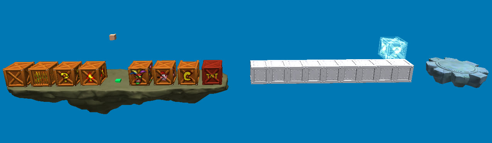

Click **New Level...** in the main menu. You can either duplicate an existing level or start from the empty template.

## Duplicate an existing level

Choose any level as the **Base Level**. The new level is a complete copy: geometry, enemies, crates, cameras, triggers and music. Edit it freely, the original game files are left untouched.

## Start from the empty template

Choose `none` as the Base Level. The new level contains only the essentials:

- a camera
- a light source
- a music theme
- a level start and a level end
- a platform with collisions
- the most common crates
- a crate counter entity, so the crate total works at the end of the level

Choosing `none` unlocks three more options:

| Option | Effect |
| --- | --- |
| **Lighting** | Imports the main lighting, ambience and background of the selected level. |
| **Music** | Imports the main music theme of the selected level. You can still [import custom music](/level-editor/special-components/music-and-audio/) later. |
| **Mode** | Crash 1, 2 or 3. It decides how the level start and level end are built, whether to add a crystal, and the style of the pause menu. |

The empty template also sets the death plane (kill plane) in `Other → WorldInstance` at -500.

## Save the new level

Custom levels are saved as `.pak` archives just like regular levels. They are saved uncompressed by default because it is faster when you test often; use `File → Compress & Save` before sharing. See [Play, save and publish](/level-editor/play-save-export/).

## Next steps

Give the level a name and a hint in [Level settings](/level-editor/level-settings/), then start populating it with the [quick-access menu](/level-editor/quick-access-menu/) and the [Object Library](/level-editor/object-library/).
