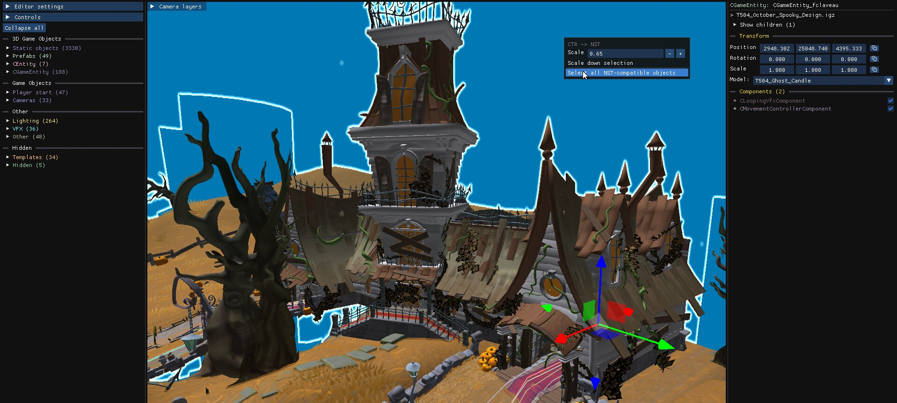

import { Steps } from '@astrojs/starlight/components';

Since v1.31 the editor can open archives and levels from *Crash Team Racing Nitro-Fueled* (PS4), display their textures correctly, edit and save them, and copy their content into NST levels.

## Limitations

- The tool has been tested on the **debug build** of CTR:NF, in which every level loads without error. Some levels from the retail version may not load correctly.
- Collisions in CTR:NF are heavily optimised: usually a single entity holds the collisions of the whole level, and most objects have no individual collision.
- CTR:NF levels are scaled by roughly 1.5 times compared to NST.
- `Right-click → Select all NST-compatible objects` selects everything that can be copied, which is the easiest way to move a whole level.

## Convert a level from CTR:NF to NST

<Steps>

1. Create a new empty level in NST, with the base level set to `none`. See [Create a new level](/level-editor/create-a-new-level/).

2. In that level, delete `Lighting → MainLighting` and `Other → worldVisualData`, so the CTR:NF lighting and skybox can take their place.

3. Open the CTR:NF level in another level editor.

4. Use `Right-click → Select all NST-compatible objects`.

5. Optionally, use `Right-click → Scale down selection` to compensate for the 1.5 times scale difference (note: this can break some visual effects)

6. Copy the selection and paste it into the empty level.

7. Save the archive. Converting every texture from PS4 to PC can take a while.

</Steps>

:::tip[Dying as soon as the level starts?]
The death plane of the empty level is probably above the imported ground. Select `Other → WorldInstance` and lower the death plane height.
:::

## CTR:NF assets in the Object Library

Scan a folder of CTR:NF archives with `Settings → Add custom folder` in the [Object Library](/level-editor/object-library/) to make its objects searchable and importable.
