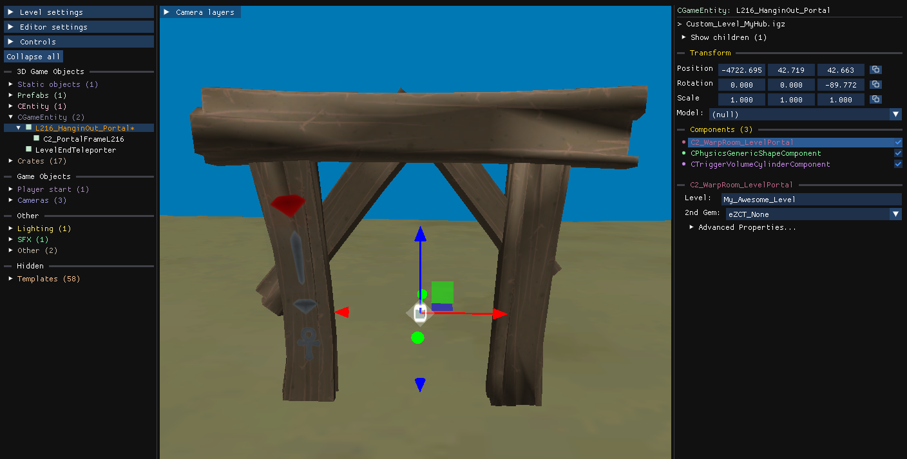

import { Steps } from '@astrojs/starlight/components';

A custom hub is a level that works like a warp room: it contains **level entrances** that lead to your other custom levels. A hub together with its levels is a **modpack**.

## Prepare each level

Every level that a hub points to must be set up once:

<Steps>

1. Locate the level archive (`.pak`) you want to add to the modpack.

2. Make sure its file name contains **no space and no special character**. `My_Amazing_1st_Level.pak` is a valid name.

3. Open the archive in the editor and run `File → Archive → Update level name`, which sets the level up internally to match its file name.

4. Save the archive and put it in the game's `archives/` folder.

</Steps>

If you rename the archive later, run **Update level name** again and update the entrance in your hub.

## Build the hub

No special step is needed to create the hub itself: create it like any level with **New Level**, then enable **Enable Hub** in [Level settings](/level-editor/level-settings/).

:::tip
`Enable Hub` is automatically turned on when importing a Level Entrance
:::

To add a level entrance:

<Steps>

1. Right-click in the scene and choose `New platform → Level entrance...`.

2. Select the new portal entity and open its `C2_WarpRoom_LevelPortal` component.

3. Set the **Level** property to the archive name of the level, without the `.pak` extension, exactly as set above.

</Steps>

## Test and share

When the hub is launched, the editor checks that every level it references is available and reports the missing ones. Finishing or exiting a level brings the player back to the hub.

Ship the hub archive and every level archive together with the installation instructions below, and consider using `File → Remove unused files` and `File → Compress & Save` on each archive to reduce the download size.

## Installation instructions for players

<Steps>

1. Put the hub archive anywhere on the PC.

2. Put all the level archives directly in the game's `archives/` folder, without creating a subfolder.

3. Use **Play Custom Level** and select the hub archive.

</Steps>

You can link players to [Install custom hubs and modpacks](/get-started/quickstart-play-level/).
