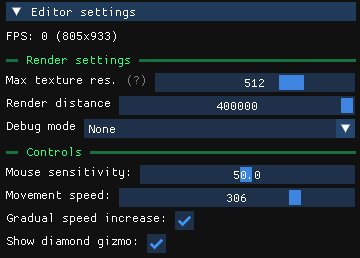

The **Editor settings** panel, in the left column, holds the settings of the editor itself. They are shared by every level. The panel also displays the current frame rate and the size of the scene view.

## Render settings

| Setting | Effect |
| --- | --- |
| **Max texture res.** | Maximum resolution at which textures are loaded. The default is 512. Lower values reduce memory usage. Restart the editor for the change to take effect. |
| **Render distance** | How far the scene is drawn. Lower it to improve performance. |
| **Camera FOV** | Field of view of the editor camera. |
| **Debug mode** | Highlights a category of objects: Static Collisions, Prefabs, Game Objects or Compatibility. See [Debug modes](/level-editor/object-tree-and-camera-layers/#debug-modes). |

## Controls

| Setting | Effect |
| --- | --- |
| **Mouse sensitivity** | Rotation speed of the camera. |
| **Movement speed** | Base speed of the camera. |
| **Gradual speed increase** | The camera accelerates the longer you keep moving. |
| **Show diamond gizmo** | Shows or hides the central gizmo when an object is selected. |
| **Grid increment** | Step used by grid snapping when you hold <kbd>Shift</kbd>. |

## Reset

**Reset settings** restores every setting to its default value.