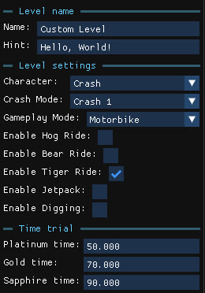

The **Level settings** panel, at the top of the left column, holds the properties of the current level. These options are only available for custom levels.

## Level name

Change the level's **Name** and **Hint** texts show on level load.

## Time trial

Change the **Platinum**, **Gold** and **Sapphire** times, in seconds, for the relics of the level.

## Level settings

| Setting | Effect |
| --- | --- |
| **Character** | Who you play as: Crash or Coco. Also includes other hidden/debug characters (`CrashBandicoot`, `BlasterTech`, `BruiserUndead`, `TemplateLegacy` and `WranglerFire`). |
| **Crash Mode** | Crash 1, 2 or 3. Affects the pause menu style and the level start and end. |
| **Gameplay Mode** | The mode or vehicle the level starts with: Traditional, Swimming, Motorbike, Jetski or Plane. Changing it updates the `WorldInstance`, the player start and the intro cutscene automatically. |
| **Enable Ride** | Required for the corresponding ride objects to work in a custom level. |
| **Enable Jetpack** | Required for the jetpack. |
| **Enable Boulder** | Required for boulder chases; fixes the boulder animation. |
| **Enable Digging** | Enables the digging mechanic found in some C2 levels. |
| **Enable Hub** | Marks the level as a custom hub. See [Custom hubs and modpacks](/level-editor/custom-hubs-and-modpacks/). |

:::note
Special objects such as rides only work when their toggle is on. If a ride does nothing in the game, check here first.
:::
