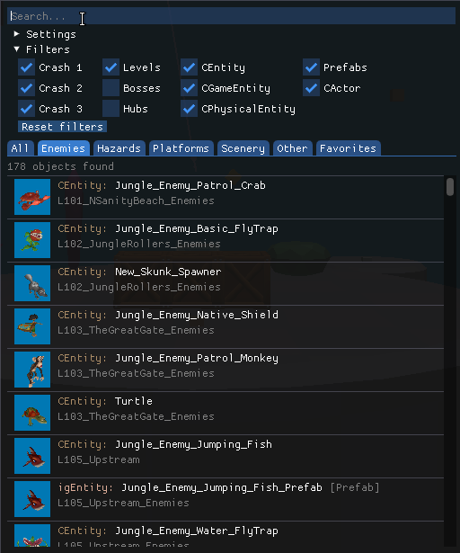

The Object Library lists the name of every object in the game with a preview image. Open it with `Right-click → Object library`.

## First initialisation

The first time you open the library, the editor scans every archive of the game to build the list and generate preview images. This takes **10 to 20 minutes** and the editor window may look unresponsive during that time. Other applications are not affected, and you can open a second instance of the editor in the meantime.

## Find an object

- **Search** through object names and file names.
- **Sort** by archive, object name or model.
- **Filter** by game (Crash 1, 2, 3), level type (Levels, Bosses, Hubs), object type and collision.
- **Categories**: All, Enemies, Hazards, Platforms, Scenery, Other and Favorites.

Each result shows its preview, its type and name, and the file it comes from. Hover a preview to enlarge it.

## Use an object

- **Click** an entry to import it into the current level, at the spot the camera is aiming at.
- **Right-click** an entry to focus it in its original archive, or to add it to your favourites.

:::note[Importing vs. copy/pasting]
Importing from the library is still a work in progress. If an imported object doesn't work correctly, try copying it from its original level instead: right-click the entry and open the archive.
:::

## Add custom archives

`Settings → Add custom folder` scans a folder of custom `.pak` archives and adds their objects to the library. This is how you make CTR:NF assets available, for instance. Do not move the archives after the scan, or the library will not be able to import their objects anymore.

:::tip
After importing a custom folder, a new filter becomes available to hide any object imported from customs folders.
:::

## Clear library data

`Settings → Clear library data` clears the object list. You can use it if there was an update to the object library, to remove custom folders, or if some previews are missing.

:::tip
Clearing the library data doesn't delete any generated preview image, which makes future initialisations faster.
:::