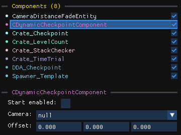
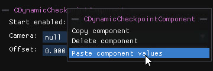

The right-hand panel shows every editable property of the selected object.

## Header

- The first line shows the object's **type and name**.
- The second line shows the **file** the object lives in. Click it to open the file in the archive editor.
- **Show parents** and **Show children** list the related objects, when any. Click one to focus it.

## Transform

Position, rotation (in degrees) and scale of the object. See [Transform and gizmos](/level-editor/transform-and-gizmos/#the-transform-panel) for the editing tricks.

## Model

When the object has a model, a **Model** dropdown lists every model loaded across the open level editors, so you can swap it. Choose `null` to make the object invisible. The **Open model file** button opens the model in the archive editor.

## Components

Components define the object's behaviour, model, animations, sounds and properties.

The list of components is at the top, the properties of the selected component below.

- Tick the **checkbox** on the right to enable or disable a component.
- **Click** a component to select/deselect it.
- **Click and drag**, or <kbd>Shift</kbd>+click, to select a range.
- **Right-click** a component to open its context menu (copy/paste/delete).

The most used components have a dedicated interface with readable names and inputs. Other components are still fully editable under `Advanced properties`, but might have unnamed parameters.

Clicking an object that the level editor cannot display focuses it in the archive editor, where every property is editable.

The [Special components](/level-editor/special-components/splines/) pages describe the components that have a dedicated interface, such as splines, trigger volumes, music and checkpoint text.
