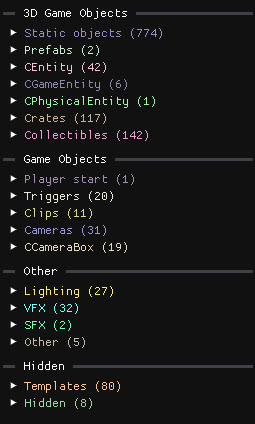

## The object tree

The left column lists every object of the level, grouped by type. 

Click an entry to open its properties, double-click to focus the camera on it, hold <kbd>Shift</kbd> to select several entries. 

### 3D Game Objects

| Group | Contents |
| --- | --- |
| **Static objects** | The static models that make up most of the level's geometry, sometimes with baked-in collisions. See [Static models](/level-editor/special-objects/static-models/). |
| **Prefabs** | Instantiated prefab entities. See [Prefab instances](/level-editor/special-objects/prefab-instances/). |
| **CEntity / CGameEntity / CPhysicalEntity** | Most game objects and spawners: enemies, hazards, platforms... See [Spawner templates](/level-editor/special-objects/spawner-templates/). |
| **CActor** | Character entities such as bosses and mounts. |
| **Crates** | Every crate in the level. |
| **Collectibles** | Every collectible in the level. |

### Game Objects

| Group | Contents |
| --- | --- |
| **Player start** | The entity where the character spawns when the level starts. |
| **Triggers** | Trigger zones. See [Script triggers](/level-editor/special-objects/script-triggers/). |
| **Clips** | Collision boxes. See [Dynamic clips](/level-editor/special-objects/dynamic-clips/). |
| **Cameras** | Every type of camera. |
| **CCameraBox** | Camera transitions. |

### Other

| Group | Contents |
| --- | --- |
| **Lighting** | Light sources and visual boxes. See [Lighting and skybox](/level-editor/special-components/visual-boxes-and-skybox/) |
| **VFX** | Visual effects. |
| **SFX** | Sound effects and music. See [Music and audio](/level-editor/special-components/music-and-audio/). |
| **Other** | Every other entity without a model, such as the `WorldInstance`, default visual settings and the level border collisions. |

### Hidden

| Group | Contents |
| --- | --- |
| **Templates** | Template objects. See [Spawner templates](/level-editor/special-objects/spawner-templates/). |
| **Hidden** | Hidden objects. |

## Camera layers

The **Camera layers** header at the top of the scene view chooses which categories of objects are drawn. Hiding layers cleans up the view and improves performance. Most hidden layers still show the objects that are part of the current selection. Your choice of layers is saved when you close the editor.

| Layer | Shows | Useful when |
| --- | --- | --- |
| **Camera Boxes** | Transition zones between two cameras | Adjusting camera transitions |
| **Dynamic Clips** | `CDynamicClipEntity` collisions | Placing invisible walls and floors |
| **Script Triggers** | `CScriptTriggerEntity` volumes | Debugging objects that do not spawn in-game |
| **Trigger Volumes** | The bounds of `CTriggerVolumeBox` components | Adjusting what triggers an object behaviour |
| **Static Collisions** | The precise collision geometry of static models | Checking where the player can actually walk |
| **Border Collisions** | The optimised level border collisions | Finding invisible walls. See [Border collisions](/level-editor/special-components/border-collisions/) |
| **Audio Boxes** | The bounds of ambient audio zones | Adjusting where a sound plays |
| **Visual Boxes** | The bounds of visual data boxes | Adjusting the main lighting |
| **Box Lights**, **Point Lights**, **Tint Lights** | The bounds of each light type | Adjusting lighting |
| **Templates** | Template objects | Editing the few enemies whose template position matters |

Templates located at (0,0,0) are hidden even when the Templates layer is on, to keep the frame rate up.

## Debug modes

`Editor settings → Debug mode` highlights objects with a colour overlay:

| Mode | Highlights |
| --- | --- |
| **Static Collisions** | Objects that have collisions |
| **Prefabs** | Prefab instances and the entities that belong to a prefab |
| **Game Objects** | Every game object: enemies, hazards, platforms... |
