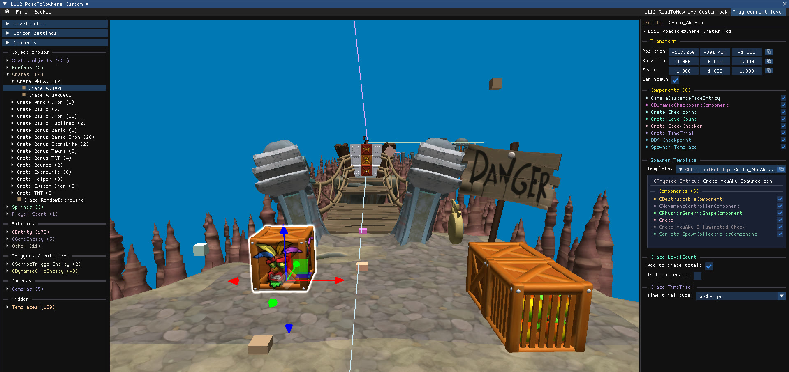

import demo from '../../../assets/screenshots/demo.gif';

The Level Editor can open any level of the trilogy, or a custom one, in a 3D scene view. You can move, copy, create and delete objects, edit their components, then launch the game to test the result in seconds.

## Key features

- **Several levels at once.** Click the Home icon or use `File → Open` (<kbd>Ctrl</kbd>+<kbd>O</kbd>) to open another level while one is already open. Drag a window's title onto another window's title to group them as tabs.
- **Multi-selection.** Hold <kbd>Shift</kbd> to select several objects, or drag a box in the scene.
- **Copy and paste across levels.** <kbd>Ctrl</kbd>+<kbd>C</kbd> / <kbd>Ctrl</kbd>+<kbd>V</kbd> works from one level editor to another, including from CTR:NF levels. See [Copy and paste](/level-editor/navigate-the-scene/#copy-and-paste).
- **Quick-access menu.** Right-click to create crates, collectibles, platforms, vehicles, bonus rounds, cameras and more. See [Quick-access menu](/level-editor/quick-access-menu/).
- **Object Library.** Search every object of the game by name, category and level, with preview images, and import it with a click. See [Object Library](/level-editor/object-library/).
- **Undo and redo** for selection and transform changes.
- **Export to glTF** to open a level or a model in Blender. See [Export to glTF](/level-editor/export-to-gltf/).

## Layout

- **Menu bar**, top-left. The **Home** icon returns to the main menu. `File` holds open, save, reload, compress, export and archive-level commands. `Backup` holds manual and automatic backups.
- **Left column.** Three collapsible panels, **Level settings**, **Editor settings** and **Controls**, followed by the [object tree](/level-editor/object-tree-and-camera-layers/) that lists every object of the level grouped by type. A **Collapse all** button folds the tree.
- **Scene view**, center. The 3D view where you [navigate](/level-editor/navigate-the-scene/), select and [transform](/level-editor/transform-and-gizmos/) objects. The **Camera layers** dropdown in the top left chooses which categories of objects are drawn.
- **Properties panel**, right. Everything about the selected object: transform, model and components. See [Object properties](/level-editor/object-properties/). The **Play current level** button sits in the top-right corner.

## Original levels and custom levels

You can open the original game levels, but the editor protects them: it never overwrites a game file unless you explicitly confirm it. Use `File → Save as...` (<kbd>Ctrl</kbd>+<kbd>Shift</kbd>+<kbd>S</kbd>) to turn an original level into a custom level saved elsewhere. Some options, such as the [level settings](/level-editor/level-settings/), are only available for custom levels.

## Supported games

The editor fully supports *Crash Bandicoot N. Sane Trilogy* (PC). It can also open levels from *Crash Team Racing Nitro-Fueled* (PS4) and copy their content into NST levels. See [CTR:NF support](/level-editor/ctr-nf-support/).