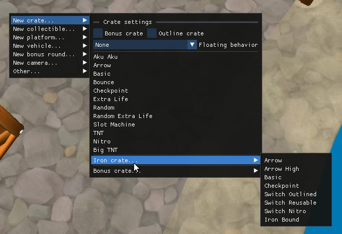

Right-click anywhere in the scene view to open the quick-access menu. New objects are created where the central dot is aiming.

## Crates

`New crate...` lets you create the different types of crates available in the game. The top of the submenu contains settings that apply to the crate you are about to create:

- **Bonus crate**: create the bonus-round variant (you can change it manually afterwards).
- **Outline crate**: create the outlined variant. See [Outline switch crate](/level-editor/special-components/outline-switch-crate/).
- **Floating behavior**: `None` or one of the floating, water or physics behaviours. ([physics demo](https://youtu.be/fTI8zat97FU)).

| Submenu | Types |
| --- | --- |
| New crate... | Aku Aku, Arrow, Basic, Bounce, Checkpoint, Extra Life, Random, Random Extra Life, Slot Machine, TNT, Nitro |
| Iron crate... | Arrow, Arrow High, Basic, Checkpoint, Switch Outlined, Switch Reusable, Switch Nitro, Iron Bound |
| Bonus crate... | Tawna, Brio, Cortex |
| Also available | Big TNT, Nitro (not bouncing), Fake Nitro |

## Collectibles

`New collectible...` lets you create any of the available collectible types.

| Submenu | Types |
| --- | --- |
| New collectible... | Wumpa Fruit, Extra Life, Aku Aku, Crystal, Time Trial, Bonus Tokens, Colored Gems... |

## Platforms

`New platform...` lets you create platforms, teleporters and level entrances.

| Submenu | Types |
| --- | --- |
| Gem platform... | Static Gem Platform, Floating Gem Platform |
| Teleporter... | Fade Teleporter, Warp Teleporter |
| Level entrance... | Crash 2 Hub Level Entrances, the portals used by [custom hubs](/level-editor/custom-hubs-and-modpacks/) |

## Vehicles

`New vehicle...` lets you create the rideable objects and their dismount points.

| Submenu | Types |
| --- | --- |
| New vehicle... | Hog (C1), Bear, JetBoard, Jetpack (C2), Tiger, Baby TRex (C3) |

:::note
Most rides must also be enabled in [Level settings](/level-editor/level-settings/) before they can work in a custom level. When you create a ride using the right-click menu, this is enabled automatically. However, if you copy/paste a ride from another level you'll need to enable it manually.
:::
## Bonus rounds

`New bonus round...` imports an entire bonus round into the level.

| Submenu | Types |
| --- | --- |
| New bonus round... | Bonus rounds for Crash 1 (Tawna, Brio and Cortex) and Crash 2/3 |

## Cameras

`New camera...` lets you add cameras and camera transitions to control how the player sees the level.

| Submenu            | Types                                                                                                                                                                        |
| ------------------ | ---------------------------------------------------------------------------------------------------------------------------------------------------------------------------- |
| Spline Camera... | The main camera type for level design. It follows a spline path and provides presets for forward, backward, sidescrolling and vertical sections.                             |
| Relative Camera  | The default camera with a fixed angle and position relative to the player. Mainly intended for testing rather than final level design.                                                    |
| Stack Camera     | A free camera that follows Crash and can be controlled using external controllers.                                                                                           |
| Camera Box       | Creates a smooth transition between the end of one camera path and the start of another. Prefer camera boxes over camera triggers when you need to connect two spline cameras. |
| Camera Trigger   | Temporarily switches to a secondary camera when triggered, typically in the middle of a camera path.                                                                         |

## Other

`Other...` let you create death triggers, collision boxes and chase sections.

| Submenu | Types |
| --- | --- |
| Death Trigger... | Creates a zone that kills Crash when he touches it. Several death animations are available (falling, burning, drowning, electrocuted...) |
| Dynamic Clip | Creates an invisible box that can collide with the player and/or enemies. |
| Dynamic Clip Switch | Creates a clip that can be activated or deactivated using two separate triggers. |
| New Chase... | Creates a Boulder, Polar Bear or Triceratops Chase. |

## Tools

| Submenu | Types |
| --- | --- |
| Select All | Selects every object in the level. |
| Select all NST-compatible objects | (CTR-only) Selects all objects that can be imported into NST, see [CTR:NF support](/level-editor/ctr-nf-support/) |
| Object library | Opens a list of all objects available in the game. See [Object Library](/level-editor/object-library/) |