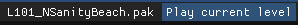

## Play the current level

Close the game if it's already running and click the **Play current level** button in the top-right corner of the level editor.

The Play button launches the game with the level **as last saved**: unsaved changes are not included. 

To save and play in one go, use `File -> Save and run` or press <kbd>Ctrl</kbd>+<kbd>L</kbd> instead.

## Save

| Action | Shortcut |
| --- | --- |
| Save | <kbd>Ctrl</kbd>+<kbd>S</kbd> |
| Backup, save and launch | <kbd>Ctrl</kbd>+<kbd>L</kbd> |
| Save as... | <kbd>Ctrl</kbd>+<kbd>Shift</kbd>+<kbd>S</kbd> |
| Reload the current level | <kbd>Ctrl</kbd>+<kbd>Shift</kbd>+<kbd>R</kbd> |
| Open another level or archive | <kbd>Ctrl</kbd>+<kbd>O</kbd> |

**Save as...** on an original game level turns it into a custom level saved elsewhere. Saving over an original game file always asks for confirmation.

## Compress before sharing

Levels are saved uncompressed by default, which makes testing faster. Before sharing a level, use **`File -> Remove unused files`** and **`File → Compress & Save`**: the archive becomes much smaller.

:::tip
`File → Compress & Save` asks where to save the compressed archive; Hold <kbd>Shift</kbd> while clicking it to overwrite the current archive instead.
:::

## Backups

The `Backup` menu of the level editor manages backups of the current level, stored next to it as `<level_name>.pak.backup`.

- **Backup** saves a manual backup and **Restore** brings it back.
- **Overwrite** replaces the existing manual backup.
- <kbd>Ctrl</kbd>+<kbd>L</kbd> creates an **automatic backup** before saving and launching. It replaces the previous automatic backup of the same level, and does not interfere with manual backups.
- There is also an option to clear the auto-backup folder as it can quickly grow in size.

:::tip
Undo only covers selection and transform changes. Take a backup before large operations such as importing a whole bonus round or deleting many objects.
:::

## Other archive commands

`File → Archive` groups commands that act on the whole archive: **Update level name** (needed for [custom hubs](/level-editor/custom-hubs-and-modpacks/)), **Export level to .gltf** (see [Export to glTF](/level-editor/export-to-gltf/)) and **Extract all files**.
