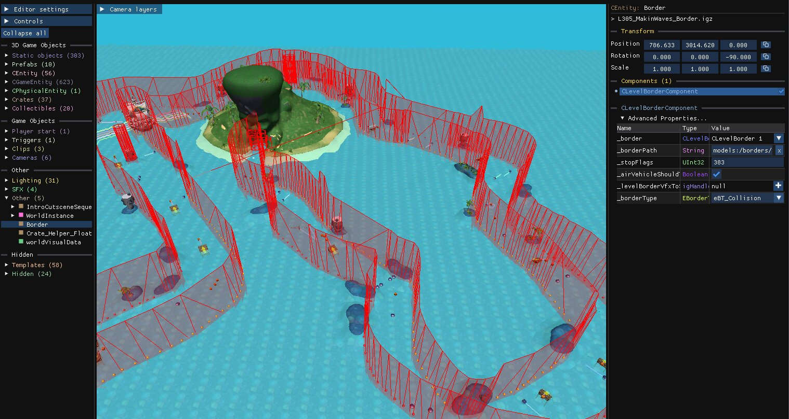

Many levels contain invisible walls that don't belong to a [static model](/level-editor/special-objects/static-models/) or a [dynamic clip](/level-editor/special-objects/dynamic-clips/). These walls are generated by a `CLevelBorderComponent`, attached to an object in the **Other** group. It provides optimised border collisions for the entire level.

Enable the **Border Collisions** [camera layer](/level-editor/object-tree-and-camera-layers/#camera-layers) to see them.

Editing these collisions is not supported. Deleting the parent object removes them entirely; you can then rebuild walls where you need them with dynamic clips.
