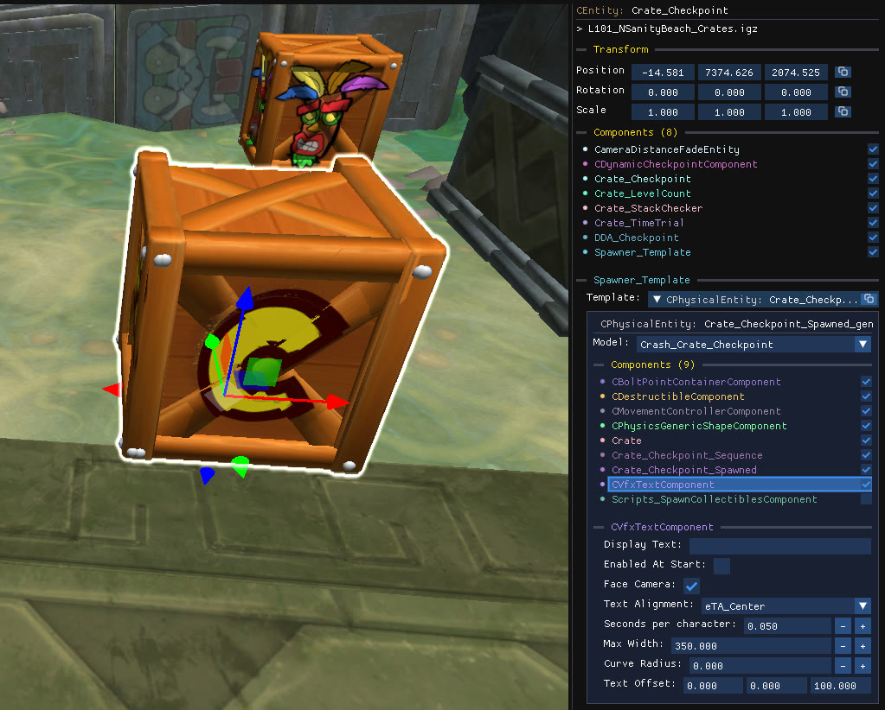

You can change the text that appears when the player breaks a checkpoint crate, as well as its position and speed.

## Find the component

The text belongs to the template object, not to the parent spawner. Select the checkpoint crate, open its `Spawner_Template` component, then select `CVfxTextComponent` in the template's component list.

## Properties

| Property | Effect |
| --- | --- |
| **Display Text** | The text to display. |
| **Enabled At Start** | Whether the text is visible before the crate is broken. |
| **Face Camera** | Keeps the text facing the camera. |
| **Text Alignment** | Left, centre or right alignment. |
| **Seconds per character** | Speed of the typing animation. |
| **Max Width** | Width at which the text wraps. |
| **Curve Radius** | Curves the text around a radius. |
| **Text Offset** | Position of the text relative to the crate. |

:::caution
This component doesn't display long text well, try to keep the text short!
:::