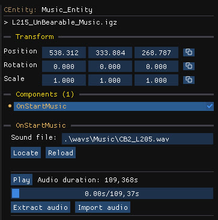

Music and sounds live in the **SFX** group of the object tree.

## Main audio components

Two main components are responsible for playing audio in a level:
- The `OnStartMusic` component (`common_OnStartMusicData`) is used to set the main audio theme for the level.
- The `CAmbientAudio` component is used to add environmental looping sound effects in some areas.  

## Edit audio

- **Play** listens to the current track.
- **Extract audio** saves the track to disk.
- **Import audio** replaces the track with your own file.
- **Locate** and **Reload** find and reload the sound file.

When you [create a level](/level-editor/create-a-new-level/) from the empty template, the **Music** option imports the theme of another level as a starting point.

## Other audio components

- `CSoundBankList` components can be found in some templates that emit sound. Use them to listen or replace the sounds of any entity.
- `CDSPOverride` components define an area in which custom audio processing is applied on top of the existing audio, for instance adding reverb to enclosed spaces

For more advanced audio editing, use the [audio previews](/archive-editor/previews/#audio-previews) of the archive editor, which can also import custom audio into `.snd` files, `CSoundSample` and `CSubSound` objects.
