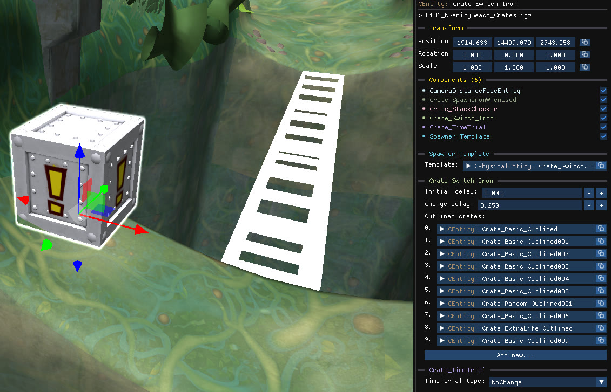

An **outline switch crate** (`Crate_Switch_Iron`) reveals a set of **outlined crates** when the player activates it. Its component has a custom interface to manage those crates.

## The Crate_Switch_Iron component

| Property | Effect |
| --- | --- |
| **Initial delay** | Delay before the entities start appearing. |
| **Change delay** | Delay between two entities appearing. |
| **Outlined crates** | The list of entities controlled by the switch. Use the icon at its right to remove or replace entries. |
| **Add new...** | Adds a new entry to the list. |

:::tip
The outline switch crate isn't limited to just crates! You can try selecting templates from other objects to spawn instead.
:::

## Create outlined crates

In the [quick-access menu](/level-editor/quick-access-menu/#crates), tick **Outline crate** before picking a crate type, or use `Iron crate → Switch Outlined` for the switch itself.
