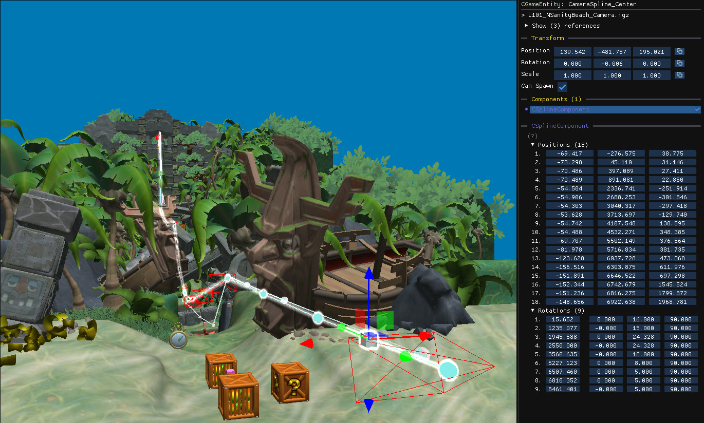

A `CSplineComponent` represents a path made of positions and rotations. Splines are used for camera paths and the movement of enemies and platforms.

## The spline panel

The component shows up to four lists:

| List | Contents |
| --- | --- |
| **Positions** | The X, Y, Z position of each control point, relative to the spline entity. |
| **Rotations** | A distance along the spline, followed by the rotation in degrees at that distance. |
| **Velocity** | Speeds that define how fast objects move along the spline. |
| **Markers** | Distances along the spline that some entities use as start and end points. |

Control points are always visible in the 3D scene. Other objects are only drawn while their list is expanded.

For rotation keyframes, **Preview** shows the camera at that keyframe and **Set from camera** copies the editor camera's current rotation into it, which is the quickest way to set up a camera path.

### Panel controls

- Edit values by clicking and dragging.
- **Click** an item to select it
- <kbd>Shift</kbd>+click to select a range
- <kbd>Ctrl</kbd>+click to add or remove one item.
- <kbd>Del</kbd> removes the selected items.
- **Right-click** to add new items.
- **Double-click** an item to focus it in the 3D scene.

### 3D controls

- **Click** a spline to select it with all of its control points.
- **Click a control point again** to select it alone.
- <kbd>Shift</kbd>+click to add or remove a control point from the selection.
- Move selected control points with the [gizmos](/level-editor/transform-and-gizmos/).

## Spline cameras

`New camera → Spline Camera...` in the [quick-access menu](/level-editor/quick-access-menu/) creates a camera with its own spline, with forward, sidescroll and vertical presets. 

Focusing a spline camera selects its child path automatically, click it again to select the camera object individually. 

Copies of a spline camera get their own spline, so editing one does not move the other.
