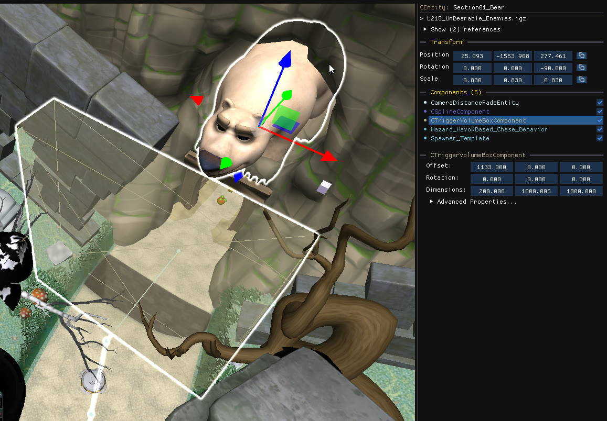

`CTriggerVolumeBox` components define a 3D bounding box that triggers an event, much like [script triggers](/level-editor/special-objects/script-triggers/). The difference is that a script trigger is a separate object, while a trigger volume is a **component of the object it triggers**.

The box is drawn only while the component is selected, or when the **Trigger Volumes** [camera layer](/level-editor/object-tree-and-camera-layers/#camera-layers) is enabled.

## Edit a trigger volume

- Move, rotate and scale it using the component panel on the right or using [gizmos](/level-editor/transform-and-gizmos/).