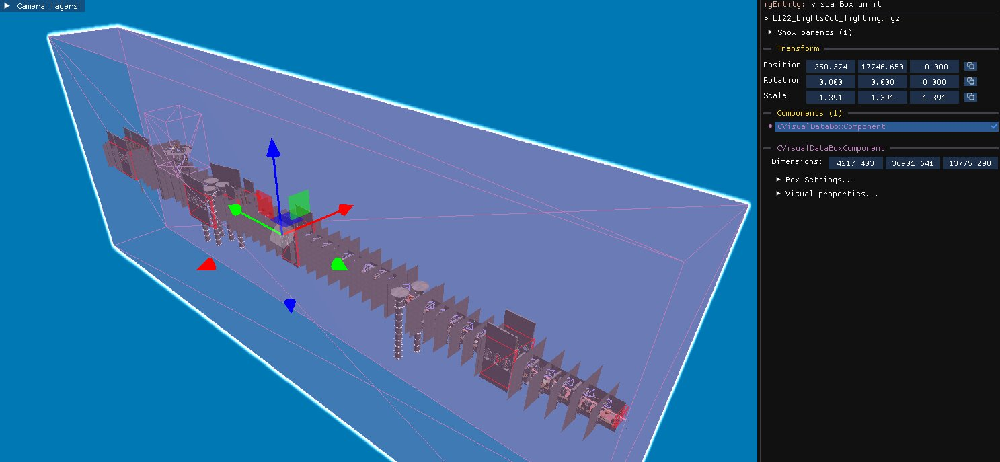

Two kinds of objects define how a level looks: one global object for the skybox and defaults, and any number of boxes that override the lighting locally.

## WorldVisualData: skybox and defaults

This object has no model/bounds, it applies to the entire level. It's found in the **Other** group of the object tree next to the `WorldInstance`.

The `CWorldVisualData` object handles the **skybox** and the **level background**. Copy and paste it into another level to import that level's sky.

It also holds the default lighting settings, used when the player is outside every visual data box. In practice these defaults are almost always overridden by the boxes described below.

:::caution
Only one `CWorldVisualData` object can be active in a level.
:::

## VisualDataBox: local lighting

Found in the **Lighting** group, objects with a `CVisualDataBoxComponent` define a bounding box inside which custom lighting settings apply, overriding the defaults of `CWorldVisualData`.

- The **main lighting** of a level is usually a single large box spanning the whole level.
- Smaller boxes override the main lighting in specific sections.

Enable the **Visual Boxes** [camera layer](/level-editor/object-tree-and-camera-layers/#camera-layers) to see their bounds, which you can move and scale like any object.

:::caution
Make sure the main lighting box is large enough to cover the entire level. If parts of the level fall outside its bounds, the lighting may change abruptly when moving between areas.
:::

## Importing lighting

- When you [create a level](/level-editor/create-a-new-level/) from the empty template, the **Lighting** option imports the main lighting and skybox of the chosen level.
- To replace the lighting of an existing level, delete its `Lighting → MainLighting` object and its `Other → worldVisualData`, then paste the ones from another level. This is also the first step of a [CTR:NF conversion](/level-editor/ctr-nf-support/).

## Light sources

Individual light sources live in the **Lighting** group of the object tree, next to the visual boxes that set the overall lighting of a level.

| Component | Light type | Camera layer |
| --- | --- | --- |
| `CBoxLight` | Box light, lighting a rectangular volume | **Box Lights** |
| `CPointLight` | Point light, radiating from a point | **Point Lights** |
| `CTintSphere` | Tint sphere, tinting everything inside its radius | **Tint Lights** |

Enable the matching [camera layer](/level-editor/object-tree-and-camera-layers/#camera-layers) to see the bounds of every light of that type at once.