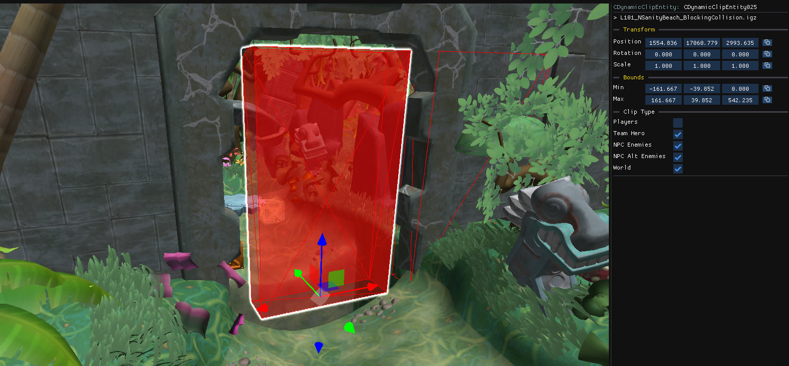

`CDynamicClipEntity` objects are invisible boxes that collide with the player, with enemies, or both. Use them as invisible walls, floors and ceilings. They are listed under **Clips** in the object tree, and drawn in the scene by default through the **Dynamic Clips** [camera layer](/level-editor/object-tree-and-camera-layers/#camera-layers).

## Create a dynamic clip

Right-click in the scene and choose `Other → Dynamic Clip`. 

You can also use `Other → Dynamic Clip Switch` to create a clip with on and off [triggers](/level-editor/special-objects/script-triggers), so the wall can be enabled and disabled during play.

## Edit a dynamic clip

- Move, rotate and scale it using the `Bounds` section on the right panel or using [gizmos](/level-editor/transform-and-gizmos/).

## Working around clips

Clicks in the scene pass through clips that are already selected, so you can reach the objects inside or behind them. Pasted objects collide with dynamic clips, which means you can paste a crate onto an invisible floor and have it land on it.
