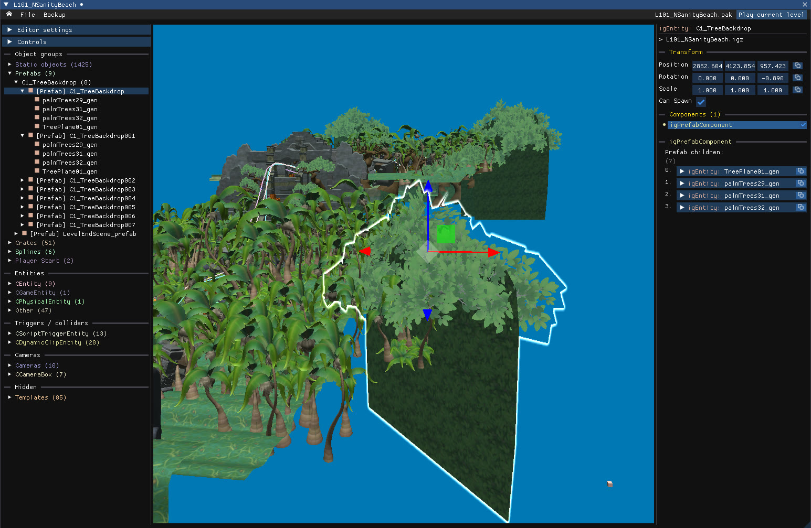
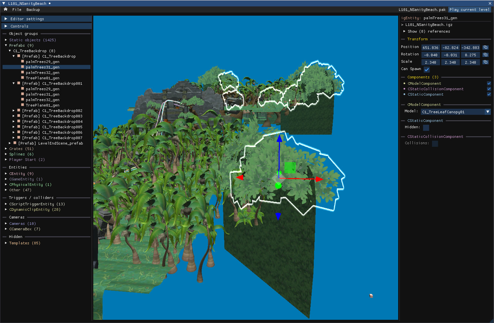

Prefabs are a special kind of object: each **prefab instance** references a group of **child objects**, and that group is shared by every instance of the same prefab. You can move instances independently, but editing one of the child objects changes it in every instance at the same time. They are listed under **Prefabs** in the object tree.

## Edit a prefab instance

Click any child object once: the **parent prefab instance** is selected. You can now treat the whole group like a regular object, move it, copy and paste it, or delete it, without affecting the other instances.

## Edit a prefab child

Click the same child object a **second time**: every occurrence of that object in the other instances lights up. You now control the child object inside the prefab. You can still move, copy, paste and delete it, but the change applies to every instance.

:::caution[Prefab children with collision]
Copying and pasting a **prefab instance** also duplicates its collisions. Copying and pasting an individual **child object**, however, does not.
:::

## Good to know

- Clicking a prefab selects the entire prefab, unless it has too many children, as bonus rounds do.
- Use `Editor settings → Debug mode → Prefabs` to highlight every prefab instance and every entity that belongs to a prefab.
