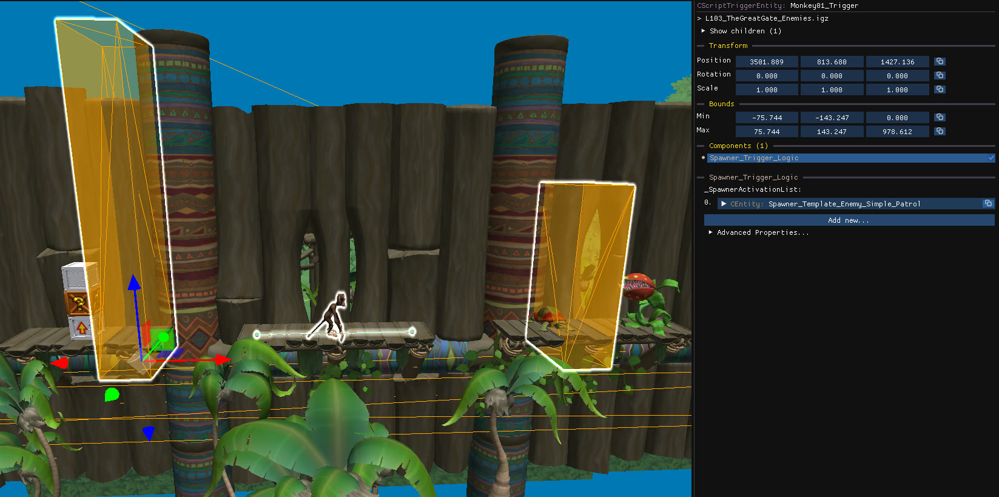

`CScriptTriggerEntity` objects are invisible boxes that trigger an action on one or more objects when the player enters their bounds. They are listed under **Triggers** in the object tree, and hidden in the scene by default: enable the **Script Triggers** [camera layer](/level-editor/object-tree-and-camera-layers/#camera-layers) to see them.

Triggers are pretty flexible and can be arranged in different ways, but in most cases, a trigger is the parent of the object it controls. Triggers can also be children of other objects, and can reference/be referenced by multiple objects.

## What they are used for

Triggers are what cause some [spawner templates](/level-editor/special-objects/spawner-templates/) to spawn their objects or become active/inactive. This allows the game to load and activate objects only when they are needed, rather than everything at once. 

Triggers can also be used to start other behaviours and effects when the player enter its bounds, such as [death triggers](/level-editor/quick-access-menu/#other).

:::caution[Object visible in the editor but not in the game?]
This is almost always a trigger problem: the trigger that should spawn the object is missing or badly placed. Show the Script Triggers layer and check that a trigger covers the area the player crosses before reaching the object.
:::

## Select triggers and their children

- **Click** a trigger with multiple children to select all of its children.
- **Click a trigger twice** to select the trigger alone.
- **Click an entity twice** to select all of its parent triggers.

Even when the Script Trigger [camera layer](/level-editor/object-tree-and-camera-layers/#camera-layers) is disabled, selecting an object will make its parent triggers visible, if it has any. Click the object a second time to add those triggers to the selection.

## Copy and paste with triggers

- Copying and pasting **child entities alone** adds the new objects to the **existing** triggers.
- Copying and pasting **child entities together with their parent triggers** creates **new** triggers that reference the new objects.

Choose the first option to add more objects to a section, and the second to duplicate a whole section elsewhere.

## Edit a trigger

- Move, rotate and scale it using the `Bounds` section on the right panel or using [gizmos](/level-editor/transform-and-gizmos/).

## Related

[Trigger volumes](/level-editor/special-components/trigger-volumes/) are components that do a similar job but belong to the triggered object itself.