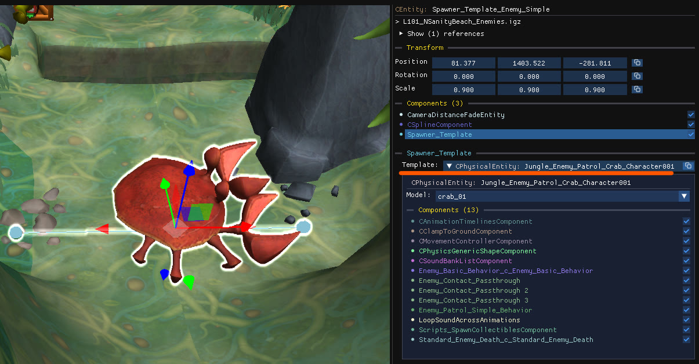
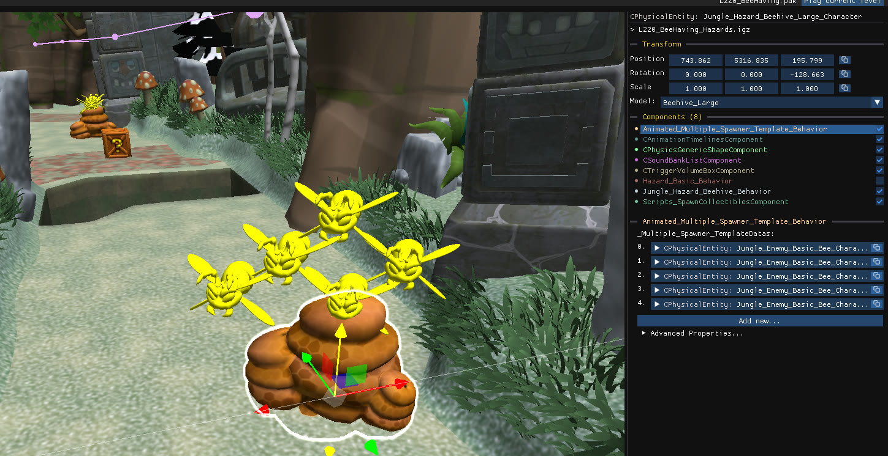

Most game entities, such as crates, enemies and platforms, are created by spawners. A spawner is an object with a `Spawner_Template` component that references a template: the object that is actually spawned and contains all of the entity's advanced properties.

## Spawner and template

- The **spawner** usually has very few components of its own, such as a spline or a trigger volume. Its job is to set the position and rotation at which the template is spawned.
- The **template** is displayed inside the `Spawner_Template` component (which is selected and expanded by default). You can change its model and edit any of its components.

Templates are listed under **Templates** in the object tree and hidden in the scene by default, because their own position is usually meaningless. For a few specific enemies the template position does matter; enable the **Templates** [camera layer](/level-editor/object-tree-and-camera-layers/#camera-layers) to see and move them. Most templates have a position of (0,0,0), those will stay hidden to preserve the frame rate.

## Templates with several spawners

A template can be referenced by several spawners. When you edit it from one of its spawners, through the `Spawner_Template` component, the editor first makes a copy of the template, so that the other spawners are not affected. Editing the template object directly will be reflected across every spawner that uses it.

## Copy, paste and move

Pasting a spawner brings its hidden template along and gives the copy its own template. Moving a spawner also moves the template (unless it's located at the origin).

## Why an enemy does not appear in the game

Spawners are typically activated by a [script trigger](/level-editor/special-objects/script-triggers/). If the trigger is missing or misplaced, the template is never spawned even though the spawner is visible in the editor.
