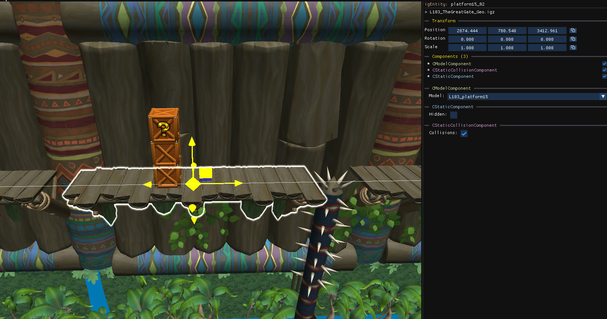

Static models represent most of the geometry of a level: floors, walls, decoration. They are listed under **Static objects** in the object tree, and can have baked-in collisions.

## The three components

The vast majority of static models always have the same three components:

| Component | Property | Effect |
| --- | --- | --- |
| `CModelComponent` | **Model** | Changes the model of the object. |
| `CStaticComponent` | **Hidden** | Hides or shows the object. |
| `CStaticCollisionComponent` | **Collisions** | Enables or disables the object's collisions. When the checkbox is greyed out, the object has no baked-in collisions. |

## See the collisions

Enable the **Static Collisions** [camera layer](/level-editor/object-tree-and-camera-layers/#camera-layers) to draw the precise collision geometry of every static model. The layer refreshes after copy, paste, delete and import. You can also use `Editor settings → Debug mode → Static Collisions` to highlight objects that have collisions.

## Tips

- Static objects are the safest objects to copy between levels, and the most likely to work.
- If a model doesn't have collisions, you can add custom collisions using [dynamic clips](/level-editor/special-objects/dynamic-clips/).
