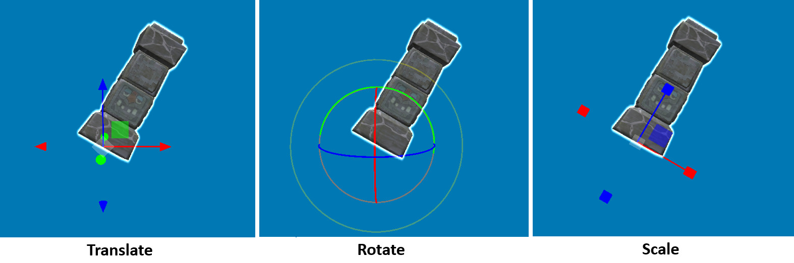
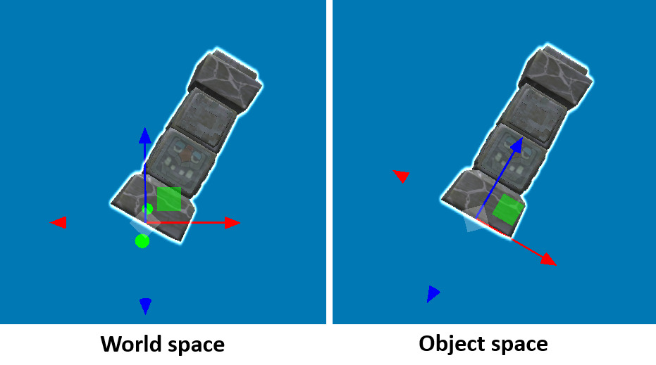
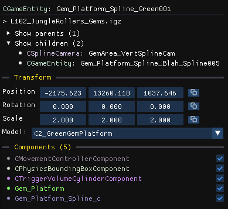

Once one or more objects are selected, you can transform them with the 3D gizmos in the scene or by editing values in the **Transform** section of the properties panel.

## Gizmos

| Mode | Shortcut |
| --- | --- |
| Translate | <kbd>Ctrl</kbd>+<kbd>E</kbd> |
| Rotate | <kbd>Ctrl</kbd>+<kbd>R</kbd> |
| Scale | <kbd>Ctrl</kbd>+<kbd>T</kbd> |
| Toggle world / object space | <kbd>Ctrl</kbd>+<kbd>G</kbd> |

Drag a color handle to change one axis; drag a color square to move on a plane. Drag the central gizmo to move in the same plane as the camera (you can hide it in [Editor settings](/level-editor/editor-settings/)).

### World space and object space

- In **world space**, the gizmo's up arrow always points to the sky, whatever the object's rotation.
- In **object space**, the gizmo follows the object's own rotation.

:::note[Special case when scaling]
Scaling is always done in object space, for technical reasons.
:::

## Snapping and alignment

- **Grid snapping.** Hold <kbd>Shift</kbd> while translating or rotating with a gizmo to snap to the grid. The increment is set in [Editor settings](/level-editor/editor-settings/) and defaults to the size of a crate.
- **Crate alignment.** Press <kbd>Left Alt</kbd> to align the selected crates with the closest crate in the scene, which makes stacks and rows tidy.

## The Transform panel

Position, rotation and scale of the selected object, with rotation in degrees.

- **Click and drag** a field to change it like a slider. Hold <kbd>Shift</kbd> for a faster change, or <kbd>Alt</kbd> for more precise adjustments.
- **Double-click** a field to type a value.
- Click the icon at the right of a row to **copy or paste** the whole row between objects.

:::tip
Using the Transform panel will apply the change to the entire selection, not just the object that is currently being edited.
:::

## Undo

<kbd>Ctrl</kbd>+<kbd>Z</kbd> undoes selection, move, rotate and scale actions. <kbd>Ctrl</kbd>+<kbd>Shift</kbd>+<kbd>Z</kbd> redoes them. Other actions cannot be undone yet, see [Undo and backups](/level-editor/undo-and-backups/#undo-and-redo).
